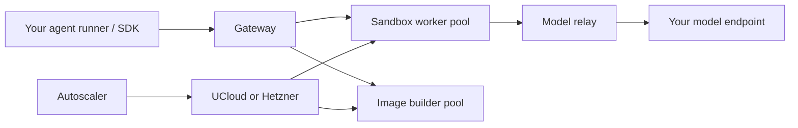

# ucloud-sandboxes

A self-hosted service for running AI agents and their tools in isolated Linux
sandboxes. Give each coding agent, evaluation task, or reinforcement-learning
rollout its own environment: choose an image, allocate CPU, memory and disk, run
commands, and read or write files through a Python SDK or HTTP API.

The service manages a shared pool of compute nodes on **SDU UCloud or Hetzner
Cloud**. Clients use one gateway URL and API token; the backend handles placement,
routing, image builds, and worker scaling. Despite the name, the sandbox API and
runtime are shared across both providers.

A central feature is **sharing worker capacity across agents waiting for models**.
Managed agents stay resident when memory is available, so they can continue
quickly without checkpoint I/O. Under memory pressure, the service checkpoints
eligible agents' processes and filesystems, releases their active memory, and
restores them when needed. This combines fast ordinary turns with higher density
for workloads containing long model waits.

## What you can do

- **Run isolated tools and agents.** Execute commands, stream command output,
  transfer files, and keep a workspace across tool calls. Use synchronous or
  asynchronous Python clients, or call the HTTP API directly.
- **Bring your own environment.** Start from an OCI/container image or build a
  custom image through the service. Separate builder nodes and a private registry
  keep image preparation independent of sandbox execution.
- **Pause and resume work.** Park eligible sandboxes with process and filesystem
  state intact. Published checkpoints also support moving work to another
  compatible node and releasing idle workers.
- **Connect agents to your models.** An OpenAI-compatible model relay connects
  sandboxes to model endpoints, including workers reachable only through outbound
  connections. It coordinates parking and waking for managed agents.
- **Share and scale a compute pool.** Request resources per sandbox, prepare
  capacity ahead of a burst, and let the autoscaler grow or shrink sandbox and
  builder pools according to demand and configured policy.
- **Control access and observe workloads.** gVisor isolates sandbox processes;
  authenticated APIs and configurable network policies control access. Metrics,
  traces, and a dashboard expose placement, lifecycle, and resource usage.

Typical uses include coding-agent evaluations, parallel benchmark tasks, and
agentic RL rollouts. The Python SDK also includes an Inspect AI integration; other
runners can use the same sandbox API.

## How it works



The gateway places a sandbox on a suitable worker and routes subsequent requests
to it by sandbox ID. Workers run gVisor sandboxes with the requested images and
resources. The autoscaler provisions provider VMs when the pool needs more
capacity. Your model inference runs separately; the relay connects it to the
sandbox workload.

For a managed agent, the model-wait cycle is:

1. The agent runs tools inside its sandbox and sends a model request through the
   relay.
2. Once the relay has durably accepted the request, the sandbox waits in memory
   or parks to make room for other work. Inference continues independently.
3. The model worker commits its response to the relay. Durable acceptance releases
   the inference slot; delivery and any necessary wake continue independently.
   The agent receives the response with its existing process and workspace state.

This lifecycle requires a parkable, managed-process sandbox started with
`start_agent()` and registered with `register_agent_rollout()`. Setting
`parkable=True` alone does not wire up model-wait parking. Ordinary parkable
sandboxes can also wake on command or file requests. See the
[managed-agent and relay guide](docs/model-relay.md) for the complete setup.

Parking normally keeps the checkpoint on the same worker for a fast wake.
Publishing it to configured snapshot storage enables recovery or migration to
another compatible worker. Unpublished local state can be lost if its worker
fails; parking alone is not a durability guarantee.

## Use a sandbox

You need a running deployment and its **sandbox API token**. Install the
[Python SDK](https://github.com/rlrs/ucloud-sandboxes-sdk) using its installation
instructions, then configure the client:

```bash
export UCLOUD_SANDBOX_URL="https://sandbox-gateway.example.org"
export UCLOUD_SANDBOX_API_TOKEN="<your sandbox API token>"
```

This example creates a Python environment, runs a command, and cleans up:

```python
from uuid import uuid4

from ucloud_sandboxes_sdk import Image, SandboxClient, SandboxSpec

client = SandboxClient.from_env()
sandbox = client.create_sandbox(
    SandboxSpec(
        id=f"example-{uuid4().hex}",
        image=Image.from_registry("python:3.12-slim"),
        command=["sleep", "300"],
        cpus=1,
        memory_mb=2048,
        disk_mb=10240,
        ttl_seconds=600,
    )
)
try:
    result = sandbox.exec(
        ["python", "-c", "print('Hello from the sandbox')"],
        timeout_seconds=30,
    )
    if not result.success:
        raise RuntimeError(result.stderr)
    print(result.stdout)
finally:
    sandbox.delete()
```

The SDK repository covers file operations, asynchronous clients, image builds,
managed agents, and Inspect AI. For clients in other languages, use the
[HTTP API reference](docs/api-reference.md).

## Deploy and operate the service

This repository contains the server, runtime, autoscaler, and deployment tooling.
A deployment combines a persistent control plane (gateway, relay, registry, and
autoscaler) with sandbox and builder worker pools. Worker pools can scale down
when idle; the control plane stays available.

Start with the [deployment flow](docs/deployment-flow.md) and
[CLI and operations guide](docs/cli-and-operations.md). For Hetzner, also follow
[the provider setup guide](docs/hetzner.md). Inspect the configuration with:

```bash
uv run ucloud-sandboxes sample-config
```

Deployment provisions the required credentials and pinned runtime artifacts;
installing the Python client alone does not start a sandbox service.

| Topic | Guide |
| --- | --- |
| Pool sizing, prewarming, and autoscaling | [Scaling policy](docs/scaling-policy.md) |
| Linux profiles and workload compatibility | [Linux environments](docs/linux-environments.md) |
| Isolation and authentication | [Security stance](docs/security-stance.md) |
| Direct, disabled, or relay-only network access | [Network policies](docs/network-policy.md) |
| Checkpoint storage and migration | [Object-storage snapshots](docs/object-storage-snapshots.md) |
| Custom images and registry maintenance | [Managed registry](docs/managed-registry.md) |
| Metrics and tracing | [Performance telemetry](docs/telemetry.md) |
| Components, placement, and routing | [Architecture](docs/architecture.md) · [Routing gateway](docs/routing-gateway.md) |
| Adding or adapting a compute provider | [Provider portability](docs/provider-portability.md) |

Sandboxes provide CPU-based Linux userspace under gVisor, rather than a full guest
kernel per sandbox. Workloads that require systemd, reboot, kernel modules, or
host devices need separate compatibility consideration. Capacity and startup
latency depend on available workers, image preparation, and checkpoint storage;
preparing capacity helps avoid cold provisioning during a burst.

## Development

Run the local verification suite:

```bash
bash scripts/check.sh
```

It checks the main Python package, shell scripts, managed-process Go code, and
SDK checkout. It fails if ShellCheck or the SDK checkout is absent. For a
deliberately reduced run, set `UCLOUD_CHECK_ALLOW_MISSING_SHELLCHECK=1` and/or
`UCLOUD_CHECK_ALLOW_MISSING_SDK=1`; the output identifies omitted checks. For a
main-package-only test run, use `uv run python -m unittest`.
