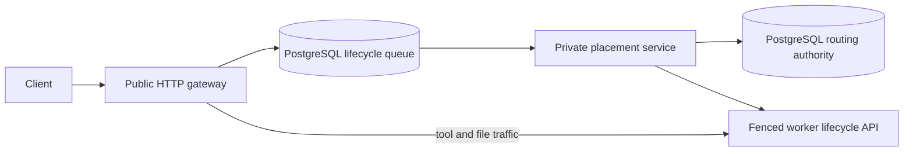

# PostgreSQL routing and durable placement

The production routing backend is selected by the authority descriptor at the
configured routing-file path. Standalone deployments can still use SQLite. The
same `RoutingStore` domain operations implement both backends: lifecycle fences,
migrations, program state, exec routes, demand, and snapshot liveness move together.
There is no second ownership model or ownership dual-write.

The motivating [production investigation](reviews/production-performance-2026-09-25-latest.md)
found a wake spending 32.109 seconds waiting for the gateway process lock and
8.780 seconds holding it, with only 0.0065 seconds of thread CPU during the hold.

## Request path

Public creates and explicit wakes that need placement enter a durable queue.
A running or waking attached owner receives its generation-fenced wake directly;
admission rechecks the route and falls back to the queue if it is no longer warm.
The relay still owns its durable wake intent and retries interrupted delivery.
The gateway transfers
waiting sockets to asynchronous response I/O; they do not retain request threads.
Placement queue I/O runs on its own event-loop thread, isolated from worker proxy
and event-stream callbacks. One batched completion reader has its own database connection so enqueue bursts
cannot strand replies behind new submissions. Both pools use the same authority;
no cache or notification becomes a source of truth. Pool wait, transaction and
commit timings use the shared PostgreSQL metrics.
The placement service uses the existing gateway lifecycle implementation on a
private loopback listener at gateway port + 1. Its separate create and wake
execution budgets bound active work, not accepted demand. Queued creates remain
visible to the autoscaler. Exec, uploads, and inference never enter the replay
queue. Implicit tool wakes continue through the canonical routing transactions.

Claims have renewable leases. Create allocation binds a queued command to its
sandbox generation in the same transaction as its route. Replaying a command
cannot recreate an explicitly deleted incarnation. Wakes retain their existing
generation/operation fences. Disconnecting a client does not discard accepted
work. Request deadlines bound waiting; an ambiguous transport outcome is reported
as unknown, never as proof that a mutation did not execute.

## Transaction boundary

`shared_control/routing_repository.py` supplies PostgreSQL persistence for the
existing domain methods. Database-only operations can retry a proven rollback;
network calls and ambiguous COMMIT failures are never replayed by that wrapper.
Worker RPCs run outside database transactions.

Exact-owner reads outside a transaction execute one autocommit query. Reads
inside placement reuse its connection and snapshot. Multi-query readers retain
an explicit repeatable-read snapshot, including snapshot-GC completeness checks;
the optimization does not weaken their consistency.

Placement uses a repeatable snapshot and durable worker revision writes. Every
capacity-changing route, inventory, wake batch, program membership, deletion, and
migration mutation advances the relevant worker revision. Migration updates
include both source and destination. Revision identities match accounting's
node ID, job ID, and normalized URL aliases. Concurrent admissions sharing an
owner therefore conflict precisely, without PostgreSQL SSI predicate conflicts
between unrelated sandbox IDs. Other domain mutations retain SERIALIZABLE.

Observations do not automatically change capacity. Program timestamps and state
progress within nonterminal membership avoid worker revision writes; entering or
leaving that membership remains fenced for cold detach. Running confirmations
that change only activity epoch and freshness also avoid a worker-wide write.
Ownership, incarnation, resources, parked activity, snapshots and migration
changes remain fenced. Race tests enforce both correctness and progress while an
unrelated operation holds the worker revision row.

Known-owner create and local-wake batches additionally take a worker-specific
PostgreSQL advisory turn **before opening the snapshot**. This suppresses wasteful
same-worker retries; revision checks remain the correctness mechanism. A local
per-worker turn is acquired before borrowing a database connection, so waiters
for a busy worker do not consume the pool needed by other workers. In-flight
create selections steer ranking away from the same worker; only the committed
reservation transaction determines admission. No
fleet-wide application mutex or SQLite writer process participates in PostgreSQL
placement. Local wakes batch by worker rather than across the whole fleet.

Standalone reads use a coherent read-only snapshot, including the snapshot-GC
completeness check and roots read. This matters even when each individual query
looks harmless. Migration queries for worker accounting and wake batches are
scoped to the relevant destination or sandbox IDs.

## Cutover and operations

1. Install the qualified runtime and PostgreSQL dependency extra in all gateway
   roles. Verify an idle fleet and no in-flight relay delivery.
2. Stop gateway, relay, autoscaler, placement, and routing readers/writers used by
   maintenance. Keep the PostgreSQL service running.
3. Run `python -m ucloud_sandboxes.shared_control.routing_cutover --routing-file
   PATH --dsn-file SECRET_FILE --schema ucloud_routing_DEPLOYMENT` as the service
   user. The command refuses active routes or incomplete migrations, snapshots
   the SQLite WAL, imports every routing table, and verifies ordered row hashes using explicit bytewise collation on both sides.
4. The command atomically replaces the routing file with a private descriptor.
   It records the retained SQLite backup. Old open stores detect inode replacement;
   old binaries reject the non-SQLite format. There is no fallback on PG failure.
5. Start `ucloud-sandbox-placement`, gateway, relay, and autoscaler. Verify health,
   create/park/wake/delete, queue drainage, and workload latency.

The placement systemd unit uses an ExecCondition to stay inactive on SQLite
installations. All configured service ports must leave gateway port + 1 free.
Backing up PostgreSQL must include the routing schema as well as relay state.
The DSN file remains the existing protected secret; descriptors contain its path,
not its value. Rollback after accepting traffic requires a verified state transfer
or restoring compatible code against the same PostgreSQL authority—not swapping
back to the retired SQLite file.

## Qualification

Tests exercise existing gateway/domain contracts on real PostgreSQL, queue claim
recovery, lost clients, delete/recreate fences, coherent GC reads, overlapping
worker identities, concurrent same-ID creates, and source/destination migration
capacity conflicts. `scripts/qualify_placement_authority.py` measures the actual
routing repository with an isolated disposable schema; it is not a guest wake
benchmark. The abandoned standalone placement prototype is not shipped.

Local canonical qualification: 512 admissions / 8 workers completed in 0.987 s,
p95 83.8 ms, no retries or overbooking. The initial blanket SERIALIZABLE version
took 5.62 s, p95 1.22 s, with 3,742 retries. Linux and native workload results must
be recorded separately before claiming production wake latency improvements.

Linux rc32 qualification on the 4-vCPU gateway host: 512 admissions / 8 workers
completed in 2.145 s, p95 201 ms, zero retries or overbooking. The final rc32
candidate passed 319 selected Linux tests. Native production measurements,
failed latency gates and subsequent refinements are recorded in the
[deployment and load qualification report](benchmarks/placement-authority-2026-09-25/README.md).
