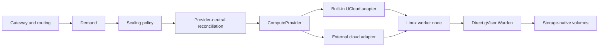

# Compute provider portability

The sandbox runtime is not a UCloud runtime. It is a Linux node stack built
around the repository's pinned, patched gVisor `runsc`, the direct Warden, and
storage-native volumes. UCloud is the built-in way to provision and bootstrap
the Linux machines that host that stack.

The provider boundary is intentionally small. It is not a general cloud SDK or
a second orchestration framework.



## What the core expects

`ucloud_sandboxes.providers.base.ComputeProvider` is the complete autoscaler
boundary. An adapter must:

- list, decode, and retrieve instances as `ProviderInstance` values;
- normalize native lifecycle states to `PROVISIONING`, `RUNNING`, `LOST`, or
  `TERMINAL`;
- decide whether an instance belongs to the configured pool scope;
- translate semantic sandbox/builder `InstanceCreateIntent` values into a
  native create request;
- preserve every create-intent label and return it through normalized
  `ProviderInstance.labels`, which is the operation-recovery identity;
- normalize create and terminate outcomes as accepted, rejected, or uncertain;
- provide a bootstrap access command when a running instance can be
  initialized.

Policy, drain safety, operation journaling, heartbeats, routing, node roles,
runtime installation, and sandbox lifecycle stay outside the adapter. In
particular, the core never branches on a provider's native lifecycle strings
and never constructs a provider API payload.

## Provider configuration

Provider settings live in one strictly tagged object:

```json
{
  "provider": {
    "kind": "ucloud",
    "scope_id": "project-1",
    "private_network_id": "network-1",
    "template_job_id": null,
    "gateway_public_link_id": null,
    "gateway_public_link_port": 8090
  }
}
```

The UCloud session file is an operational credential override, supplied with
`--session-file` to local operator commands when needed. It is deliberately
not persisted in `deployment.json`.

UCloud rejects unknown keys. An external provider owns and validates the keys
inside its tagged object; provider-specific credentials, image references,
network identifiers, and machine profiles belong there rather than in core
models.

## Adding another provider

Implement `ComputeProvider`, then expose a factory with the signature
`factory(configuration, cli_options) -> ComputeProvider`. Register it under
the configuration `kind` in the Python entry-point group
`ucloud_sandboxes.compute_providers`:

```toml
[project.entry-points."ucloud_sandboxes.compute_providers"]
examplecloud = "examplecloud.sandboxes:build_provider"
```

The factory receives the tagged `ProviderConfiguration` and the shared parsed
autoscaler options. It should keep cloud-specific options in the tagged
configuration. No policy, reconciliation, routing, registry, or runtime module
needs to be changed.

Use a fake implementation of the same protocol for contract tests. At minimum,
test lifecycle normalization, pool eligibility, request rendering, ambiguous
mutation recovery, and bootstrap access discovery.

## Infrastructure required on another cloud

The adapter only solves compute provisioning. A deployment also needs:

- Linux VMs on which the bootstrap user can run privileged installation;
- private reachability from the gateway to node-agent and SSH endpoints;
- the kernel/module and block-device support required by the verified node
  bundle, including the storage-native ublk path;
- durable gateway state and registry storage;
- a way to distribute the verified node bundle and credentials;
- stable node identities and enough metadata or labels to recover provider
  operations after ambiguous API responses.

The in-tree `deploy-all-in-one`, UCloud resource helpers, and session handling
remain UCloud-specific operator conveniences. A different cloud should provide
its own deployment automation, but it reuses the same gateway and worker
services after provisioning. This is the remaining infrastructure integration
work; it is not a runtime or autoscaler-policy dependency.
