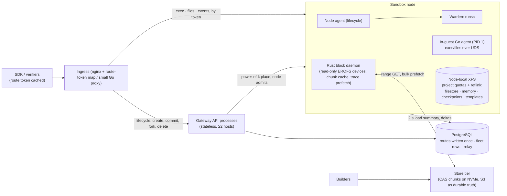

# RL-scale architecture plan

Status: proposed, 2026-10-01, against `90ce959` (package 102,852 lines).
Nothing in this document is deployed. Where it conflicts with the delivery
sequence in [performance-architecture-plan.md](performance-architecture-plan.md)
(P2–P5), this plan takes precedence. Its rules on generation fencing and
measurement discipline still apply.

The comparison frame is the six-axis design space from the RL-sandboxing
survey: isolation boundary, image representation, composition, memory
sharing/reclaim, state model, and control plane. The reference design is
DeepSeek DSec, adapted to gVisor on provider VMs without KVM.

## 1. Summary

We already chose the right isolation boundary: gVisor inside a cloud VM, which
gives defense in depth without needing `/dev/kvm`. Most of the cost and
complexity sits in the layers around that boundary, and they were shaped by one
feature: hibernating one long-lived managed agent across model waits, and
migrating it with hard disk guarantees. RL wants something else:

- identical prepared state per task, started N times;
- cheap pause rather than durable hibernation;
- image bytes that cross the network once per node;
- a placement path that does no strongly consistent work per sandbox.

The plan has nine moves:

1. **Measure what the survey's table measures** before changing anything:
   page sharing, PSS/USS, per-phase create time, bytes fetched, and fork and
   pause latency (W0).
2. **Make pause cheap and make it the default**: cgroup freeze, then
   `memory.reclaim`, then prefetch on thaw. That is DSec's container pause.
   Hibernation becomes a rare tool for drain and offload (W1).
3. **Stop copying the guest's written data on every park.** Today the gVisor
   filestore is serialized into `pages.img` on every hibernate (W1).
4. **Collapse writable state onto one node-local XFS with project quotas and
   reflink.** This retires the per-sandbox ublk/overlaybd/XFS volume and its
   four disk ledgers (W1).
5. **Take Python off the image data path.** Serve EROFS components from the
   Rust block daemon, keep metadata local, prefetch startup traces, and move
   the shared tier off the gateway VM (W2).
6. **Share hot image pages across sandboxes** by mounting EROFS inside the
   Sentry, if measurement confirms the gofer path duplicates them (W2).
7. **Add the RL state primitives**: commit (DSec `pack_diff`), group create
   that packs a rollout group onto one node, and fork from a template (W3).
8. **Make the control plane DSec-shaped**:
   - route tokens, so ingress is stateless;
   - power-of-k placement with each process's own overlay;
   - the node as the final admission authority;
   - no per-create capacity revision transaction;
   - a gateway VM that no longer hosts the database, the registry and NAT
     alongside the API (W4).
9. **Delete the mechanisms these replace.** Target: package ≤ 78k lines (from
   102.9k), with a CI budget that stops regrowth (W6).

## 2. Where we stand on the six axes

| Axis | Today (evidence) | DSec | Verdict |
| --- | --- | --- | --- |
| Isolation | gVisor `--platform=systrap` inside UCloud/Hetzner VMs (`direct_warden.py:2082-2101`). There is no KVM on UCloud (`docs/reviews/sandbox-compatibility-followup-2026-09-05.md`). | Containers inside QEMU VMs, plus microVMs and full VMs. | **Keep.** This is the same defense-in-depth posture. |
| Image representation | Per-layer-group EROFS components: one blob each in the gateway's OCI registry, a signed 256 KiB chunk index, and HTTP Range reads through a **Python NBD server** (`environment_nbd.py`, `environment_cache.py`). Each component is host-mounted, composed with host overlayfs, and served to the Sentry through the gofer. Metadata is fetched on demand. Docker overlay2 is still the code default. | EROFS layers with **local metadata** (multi-device), data on 3FS, a node cache, and bulk on-demand reads. | Right format, wrong plumbing: Python on every miss, re-hash on every cache hit, no metadata split, and a shared tier that is one VM's Volume. |
| Composition | Monolithic per-task images, factored *offline* into foundations, anchors and deltas by about 26k lines of `scripts/`. The schema has a `workspace` slot and a `toolkits` slot, but production never fills either (`environment_config.py:78`). Init binaries are copied into every rootfs at create (`direct_oci.py:355-436`). | Base + workspace + toolkit layers stacked at create (about 30 lines of Go in dockerd). | Missing runtime composition. Every scaffold change rebuilds images. |
| Memory sharing and reclaim | RAM-backed application memory on a **noswap** tmpfs (`build/hetzner-prod/deployment.json`: `direct_ram_memory_backing=true`, `swap_gb=0`). The only way to return anonymous memory is a full hibernate. Clean-cache `memory.reclaim` runs only for relay waits (`resident_memory.py:282`). Whether the gofer path duplicates image pages per sandbox has **never been measured**. | Shared host page cache; container pause by freeze + swap + `memory.reclaim` with `MADV_WILLNEED` on resume. | Missing the cheap middle tier. 16 SIGBUS deaths at 256 × 1.5 GiB came from tmpfs exhaustion (`docs/benchmarks/pressure256-2026-09-23`). |
| State model | Park means `runsc checkpoint --hibernate` plus sealing an overlaybd layer. The checkpoint serializes the **whole filestore**, so 2.5 GB of `/workspace` writes took 48–96 s to park (`docs/disk-density.md:120-131`). Publication goes to the registry, plus migration of parked sandboxes. The idle timer parks after **1.0 s** in production and publishes in the background. There is no template, fork, commit or recycle. | Pause/resume, incremental disk snapshot (`pack_diff`), and keeping rollout state for reconnects. AgentENV adds fork and templates. | Built for durability, not reuse. Every rollout re-runs setup. |
| Control plane | Client-chosen IDs and **a PostgreSQL route lookup on every request**: exec, events and files (`routing.py:740`, `exec_routing.py:51`). The create path is: durable queue, then a placement process that replays the request over **loopback HTTP**, then a whole-fleet scan, then `worker_capacity_revisions` under REPEATABLE READ. That is about 6 transactions and 35–45 round trips per create. Heartbeats come from a fresh Python process every 20 s carrying full inventory into host-local SQLite. One 4-core VM hosts TLS, 6 API processes, placement, relay, PostgreSQL, the 1 TB registry and NAT. | Stateless ingress; the sandbox ID encodes its node; sample k nodes and pick the least loaded; each instance overlays its own decisions; the node has the final say; more than 5,000 creates/s per 160-node unit. | Strongly consistent where it need not be, and co-located where it cannot afford to be. The 2026-09-30 incident had 4,087 serialization aborts (3,455 on `worker_capacity_revisions`), 6,176 build 503s, and registry await of 48–205 ms. |

## 3. Diagnosis: the couplings that cost us

Each item names the coupling, not just the symptom. The survey's point applies
here: the interesting tradeoffs are the couplings.

### D1. The writable layer is copied into every checkpoint, and four ledgers exist to pay for it

The stack has five storage levels:

```
ublk  →  overlaybd  →  XFS  →  host overlayfs upper  →  gofer  →  Sentry overlay (root:self)  →  filestore
```

runsc gets no `--overlay2` flag, so guest writes land in
`.gvisor.filestore.<cid>` inside the host upper (`direct_warden.py:2453-2470`).
A hibernate serializes that file into `pages.img` and punches it.

The per-sandbox block volume, with its grant growth poller, sealing,
compaction, publication and published-local cache, therefore mostly carries
bytes that the checkpoint also copies. The capture reservation is
`R = memory + resident + filestore + 64 MiB` (`docs/disk-density.md:131`). Disk
claims, not RAM, capped density at about 180–200 parkable sandboxes per UCloud
node (`docs/benchmarks/density-rc38-2026-09-26/README.md`: 89.8% of hard disk
reserved, 59–82 GB of RAM free).

There are four disk ledgers (registry, storage daemon, memory `bhard`, RAM
tmpfs) and about 8.2k lines of `storage_native_*.py`.

### D2. The state model has no reuse primitive

There is no template, fork, commit or recycle. Checkpoints are single-owner
and consumed on wake (`runtime/gvisor/README.md`, "Ownership invariants").

What "prepared" means today:
- The prepared catalog, foundations and anchors are offline, image-level work.
- `POST /v1/capacity/prepare` only reserves capacity and warms images.

So each rollout in a group cold-boots and re-runs any setup the image did not
bake in. Meanwhile 742 of 35,984 inventoried source references are prepared
(`docs/shared-task-images.md`), because image factoring is the only reuse
mechanism we have.

### D3. Python sits on every data path

- **Image misses.** Every page-cache miss goes kernel → NBD → Python, which
  fetches serially within one NBD request and re-hashes the chunk with SHA-256
  even on a cache hit (`environment_cache.py:72-95, 227-238`). Under CPU
  saturation, first-touch turns were about 2× slower than Docker
  (`docs/image-import.md`, rc57).
- **Exec.** Every exec, including file reads and writes, is a host
  `runsc exec` plus three Python threads with a manager-wide RLock taken per
  output chunk (`sandbox_exec.py:201, 398-458`). Measured: about 115 exec
  starts/s per node (GIL-limited), 20 MB of stdout in 23 s, and text-mode pipes
  that mangle binary output.
- **Gateway proxying.** Every exec, events and files byte passes through a
  Python gateway process, after a PostgreSQL route read plus a SERIALIZABLE
  `upsert_exec` (`routing.py:2799-2825`).
- **Node create.** At least four `synchronous=FULL` SQLite commits and four to
  six `ip` subprocesses. `iptables-save` runs on most creates.

### D4. The control plane serializes placement and centralizes the shared tier

- **Per-create capacity transaction.** Correctness rests on write-write
  conflicts on `worker_capacity_revisions`. Heartbeat reconciles, create
  confirmations and program-membership changes bump those same rows
  (`routing_repository.py:263-389`). Under a burst this is an abort storm by
  construction.
- **Creation rate.** The database-only benchmark tops out at about 240
  admissions/s on the gateway host (`placement-authority.md`). End to end we
  observe about 9–13 sandboxes/s (`build/gateway-qualification/actual4-512.json`).
- **Shared tier.** The image and checkpoint tier is the gateway's registry
  Volume, on the same 4 vCPUs as TLS, PostgreSQL and NAT.
- **Host-bound gateway.** SQLite heartbeat state, host `flock`s
  (`registry-leases` on the create path) and a single placement and autoscaler
  pin the gateway to one host (`deployment-flow.md:111-119`).

### D5. Composition happens offline, so the corpus has to be rebuilt to compose

- Foundations, image pools, the prepared catalog, flat deltas, the layered
  task pool and compact project bases all exist to shrink unique OCI layers.
- Toolkit and harness layers are not separated: "Bash/OpenCode/Pi harness
  setup remains separate" (`docs/image-pools.md`).
- `EnvironmentManifest.toolkits` is reused to hold ordinary layer groups
  (`environment_builder.py:889-890`).

### D6. Mechanisms accrete in parallel

- **Size.** The package grew from 60,785 lines (2026-08-12) to 102,852
  (+69%). Tests grew from 33k to 82k lines.
- **Overlapping mechanisms.** Six policies decide when to hibernate or move a
  sandbox: idle timer, warm park, resident reclaim, cold offload,
  drain-on-park, consolidation. Next to them:
  - three memory modes;
  - two rootfs adapters;
  - two lazy block stacks with separate caches reading the same registry;
  - SQLite and PostgreSQL routing, where PostgreSQL subclasses SQLite with
    `?`→`%s`;
  - five admission modules;
  - a shadow-only program scheduler on the hot path.
- **Hot-spot files:**
  - `ControlPlaneHandler`: 6,634 lines and 160 methods.
  - `_create_sandbox_on_node_locked`: 542 lines, and it runs a synchronous
    external image import inside the create.
  - `dashboard.py`: 7,478 lines of embedded HTML/CSS/JS.

## 4. Target architecture



| Axis | Target choice | Why |
| --- | --- | --- |
| Isolation | Unchanged: gVisor systrap in provider VMs. | No KVM on UCloud. A user-space kernel owns all state, so checkpoint needs no CRIU. |
| Image representation | EROFS components; signed root and chunk index; metadata block ranges recorded at publish and prefetched at attach; chunks served by the Rust block daemon from a bounded content-addressed node cache. If W0 shows gofer duplication, the Sentry mounts EROFS directly. | DSec's local metadata plus on-demand bulk reads, with no Python on the miss path. |
| Composition | `base` (task image components) + `toolkit` (versioned EROFS at `/opt/ucloud`) + optional `delta` (a commit or template) stacked at create. | A harness change becomes a toolkit version, not a corpus rebuild. |
| Memory | One mode. Pause is freeze + `memory.reclaim` with zswap and NVMe swap, then thaw with prefetch. Hibernate runs only for drain, offload, or predicted waits of more than N minutes. | Pause costs track the pages actually evicted, with no snapshot format and no disk claim per pause. |
| State model | Pause, hibernate, commit, group create, fork from template. Templates are caches, never sources of truth. | Gives RL the primitives it needs: one setup per group, identical initial state, cheap waits. |
| Control plane | Route tokens; power-of-k placement in each gateway process with its own in-flight overlay; node admission is final; one route write per create; fleet rows in PostgreSQL; store tier and database off the API host. | Follows DSec's own observation: placement needs only eventual consistency as long as each node enforces its own limits. |

## 5. Workstreams

Every change lists **Change**, **Where**, **Deletes**, and **Gate**. Gates use
the W0 harness at fixed hardware, image set and cache state, with three or more
comparable runs, per the existing qualification rules.

### W0 — Measurement that matches the survey's table (weeks 1–2)

**C0.1 `scripts/bench_rl_scale.py`, one report schema for the ten metrics.**

- **Metrics:**
  1. cold time to first command;
  2. warm time to first command;
  3. burst completion (N sandboxes over M images: all-ready time and worst
     single wait);
  4. sustained creates per second, per node and per cluster;
  5. bytes fetched as a share of image size;
  6. density at a fixed p99 tool-call latency;
  7. idle PSS and USS;
  8. page-sharing ratio;
  9. pause and resume latency, plus bytes written;
  10. fork latency against dirty memory.
- **Where:** extend `scripts/live_relay_load_benchmark.py` (driver and
  integrity checks) and `scripts/benchmark_sandbox_density.py`. Do not add a
  third driver.
- **Workloads:**
  - a fixed SWE-smith subset (one image per repo, a branch per task);
  - a TMax subset (one image per task, the worst case);
  - the existing 512 MiB / 128 MiB-dirty synthetic agent.

**C0.2 Per-phase node create timings.**

- **Change:** `create_with_timings` (`node_runtime.py:489`) reports only
  `total_ms`. Record:
  - admission wait;
  - rootfs resolve and attach;
  - storage prepare;
  - network ensure;
  - OCI build;
  - init copy;
  - `runsc create` and `runsc start`;
  - registry commits.
- **Also:** propagate gateway-side placement, image-resolve and queue time
  under the same trace.

**C0.3 Page-sharing probe. This decides C2.4.**

- **Setup:** K ∈ {1, 8, 32} sandboxes on one image, each running an
  import-heavy command (for example `python -c "import numpy, scipy, pandas"`).
- **Report:** host ΔMemAvailable, Σ cgroup `memory.current`, Σ
  `memory.stat:file`, each Sentry's application-memory-file allocated bytes,
  and Sentry PSS and USS.
- **Configurations:**
  - (a) current host-EROFS + gofer;
  - (b) the same with `--file-access=shared` on the rootfs;
  - (c) Sentry-native EROFS via `runtime/gvisor/qualify_erofs.py`.
- **Hypothesis to confirm or reject:** gofer-served file data is cached in each
  Sentry's memory file and therefore duplicated K times. In RAM mode that cache
  also lives on the noswap tmpfs and is exported on park.

**C0.4 Production counters for the decisions below.**

- **Change:** add metrics for:
  - parks by trigger (idle, relay, explicit, drain, offload);
  - wakes on the same node versus another node;
  - migrations and drain moves per day;
  - publication bytes;
  - chunk-cache hit and miss bytes;
  - store-tier bytes/s per node;
  - registry await.
- **Why:** C1.3 and C3.3 depend on how often cross-node wake actually happens.

**Gate.** A baseline report for all ten metrics on UCloud and Hetzner, using
today's code, preserved under `docs/benchmarks/rl-scale-baseline-*`.

### W1 — Writable state and pause (density)

**C1.1 A pause tier that becomes the default.**

- **Pause:**
  1. `runsc pause`. It does not freeze the cgroup (2026-10-02 qualification); a separate `cgroup.freeze` is optional.
  2. Record resident ranges of the application-memory file (`mincore` or
     `cachestat`).
  3. Write `memory.reclaim` in bounded windows with `swappiness=` set for
     anonymous pages. The code already uses the swappiness argument for clean
     cache (`resident_memory.py:282`).
- **Swap:**
  - zswap (zstd) in front of an NVMe swap partition sized from W0.
  - Mount the RAM tmpfs without `noswap` (`memory_filesystem.py:308`,
    `vm_init.py:704-705`).
- **Thaw:**
  1. `runsc resume`.
  2. Prefetch the recorded ranges with `MADV_POPULATE_READ` on a shared
     mapping of the memory file, from the Warden, within a byte budget.
- **Policy:**
  - Idle-timer parks and relay model waits pause.
  - Hibernate only for drain, disk-pressure offload,
    `park(durable=true)`, or `expected_remaining_wait_seconds` above a
    threshold computed from the Aries rule: idle time × resident cost >
    capture + restore cost.
  - Turn off background publication after idle parks (production:
    `direct_idle_park_seconds=1.0`).
- **Ownership:** a paused sandbox keeps its live generation and route. No
  gateway transition is needed, and the relay's park/wake obligations become
  node-local calls.
- **Deletes:**
  - `warm_park.py` (698 lines) shrinks to one roughly 150-line pure policy.
  - `resident_memory.py` (328) merges into the pause path.
  - `consolidation.py` (105, dormant in production).
  - Most of the growth-forecast and RAM-headroom projection in
    `direct_service.py` and `transition_admission.py`. With swap, overflow
    degrades latency instead of causing SIGBUS.
- **Gate:**
  - pause ≤ 50 ms and thaw ≤ 100 ms plus refault, on the 512 MiB / 128 MiB
    profile;
  - physical I/O per turn at most the current resident-wait path;
  - no SIGBUS at the `pressure256` shape.

**C1.2 gVisor patch 0008: an external filestore backing.**

- **Change:** extend the external-backing idea of `20260817/0001` (metadata-only
  `SaveTo`/`LoadFrom` for application memory) to the rootfs overlay's filestore
  memory file:
  - checkpoint saves allocator metadata only;
  - restore reopens the same file;
  - fork reflink-clones it.
- **Effect:** hibernate cost becomes independent of how many bytes the guest
  wrote. Parking 2.5 GB of writes drops from 48–96 s to roughly memory-only
  time (0.25–0.7 s measured). The `filestore` term leaves `R`.
- **Where:**
  - `runtime/gvisor/20260817/0008-ucloud-external-filestore.patch`;
  - `build_pinned.sh`;
  - the capture reservation in `direct_warden.py:2769-2900`.
- **Gate:** the existing hibernation conformance (`qualify_gvisor_hibernation.py`,
  `compatibility_workload.py`) passes, plus a write-heavy park/wake whose
  latency does not depend on bytes written.

**C1.3 One writable backing: node-local XFS with project quotas and reflink.**

- **Layout:** each incarnation gets
  `/var/lib/ucloud/incarnations/<id>/{filestore,memory,state}` with one XFS
  project quota.
- **Quota growth** becomes `xfs_quota limit` instead of `xfs_growfs` on a
  per-sandbox filesystem.
- **Portability**, for drain and offload only: upload the directory's sparse
  files as content-addressed 4 MiB zstd chunks to the store tier; import by
  download.
- **Removes:**
  - per-sandbox ublk device acquisition, `mkfs.xfs` and mount at create
    (`storage_native_daemon.py:1749-1837`);
  - the 0.5 s `statvfs` growth poller;
  - layer sealing, compaction, and the published-local cache;
  - three of the four disk ledgers.
- **Decision gate:** C0.4 cross-node wake frequency. If cross-node lazy restore
  turns out to matter, keep overlaybd *only* as an export format, not as the
  live writable device.
- **Deletes:**
  - `storage_native_daemon.py` (4,137), `storage_native_s3.py` (914),
    `storage_native_registry.py` (823), `storage_native_migration.py` (566),
    `storage_native.py` (410), `storage_native_compaction.py` (409),
    `storage_native_s3_gc.py` (332), `storage_native_service.py` (252),
    `storage_native_publication.py` (227), `storage_native_local_cache.py`
    (102): 8,172 lines in total.
  - The storage-native branches in `direct_warden.py`, `direct_registry.py`
    and `vm_init.py`.
  - The writable-path AgentENV patches: pooled-delete, owner-identity,
    owner-transitions, premerged-identity, storage-upgrade-compatibility and
    streaming-dense-export. The Rust daemon stays for images (C2.1).
- **Gate:**
  - the create path's storage phase falls from about 131 ms (ublk + mkfs +
    mount) to under 10 ms;
  - hard-disk claims stop being the binding density limit at the rc38 workload.

**C1.4 One memory mode.**

- **Decision:** choose between RAM tmpfs with swap and an XFS file with reflink
  restore, using a W0 matrix: running I/O interference
  (`benchmark_backing_interference.py`), pause and thaw, hibernate and restore,
  and fork restore.
- **Deletes:** the losing mode's branches in `memory_backing.py` (1,025 lines
  across 3 modes), its patch (0006 or 0007), and `memory_filesystem.py` (341)
  if file mode wins.
- **Expectation:** RAM with swap wins for running and paused sandboxes.
  Checkpoints and templates still live on XFS.

**C1.5 CPU QoS for background work.**

- **Change:** create `ucloud-sandboxes/{fg,bg}`. Run prefetch, publication,
  commit (`mkfs.erofs`), offload and chunk-cache fill in `bg` with
  `cpu.idle=1`, the cgroup form of `SCHED_IDLE`. Give restore candidates and
  thaws a higher `cpu.weight` for their first second.
- **Context:** there are no weights or idle classes today. A grep finds no
  `cpu.weight`, `cpu.idle` or `SCHED_IDLE`.
- **Gate:** foreground tool p99 under a background publication burst, using the
  existing interference workload. Measure before considering core scheduling.

### W2 — Image plane

**C2.1 The Rust block daemon replaces the Python NBD server and cache.**

- **Change:** add a read-only "verified blob device" target to the pinned
  AgentENV `uvm-ublk-daemon`:
  - one ublk device per EROFS component;
  - misses fetched as bulk ranges from the store tier and verified once
    against the signed chunk index;
  - stored in the existing bounded cache pool;
  - hits served from the cache file with no re-hash. The cache is root-owned
    local disk, the same trust level as the host filesystem.
- **Effect:** page-cache hits stay in the kernel and cache hits stay in Rust.
  Python only attaches and detaches.
- **Deletes:**
  - `environment_nbd.py` (234), `environment_cache.py` (246) and most of
    `environment_backend.py` (300);
  - the 1,024-device NBD module pool and its kernel-ownership workarounds
    (`docs/immutable-environments.md`, "Two kernel details");
  - the second lazy-loading cache.
- **Gate:** first-touch turn latency under CPU saturation no worse than Docker
  (it is about 2× worse today), and node CPU per cold MiB halved.

**C2.2 Local metadata without a format change.**

- **Change:** at publish, parse the EROFS image and record the block ranges
  holding the superblock, inodes, directories and xattrs in the signed index
  (`environment_artifact.py`). On attach, prefetch every metadata range in one
  bulk fetch.
- **Effect:** path lookups never hit the network, which is the purpose of
  DSec's multi-device layout.
- **Gate:** zero remote reads during `find / -xdev > /dev/null` after attach,
  and a lower p99 for cold time to first command.

**C2.3 Startup access traces and prefetch.**

- **Record:** on sampled first runs, the block daemon records the chunk set
  touched in the first 60 s per (image, entrypoint class). It is uploaded as a
  small signed `trace` artifact next to the component.
- **Replay:** later attaches prefetch the trace set in parallel coalesced
  ranges before `runsc start`, bounded by a byte budget and the `bg` CPU class.
- **Gate:**
  - cold time to first command p50/p99 against C0.1;
  - fetched bytes stay at or below the trace set plus 20%.

**C2.4 Sentry-native EROFS rootfs, conditional on C0.3. Demoted 2026-10-01: S2 measured about 9 MiB per sandbox saved, not a density lever. Keep it only as optional mount cleanup.**

- **Change:** runsc patch 0009 makes the rootfs an ordered list of EROFS
  lowers:
  - `dev.gvisor.spec.rootfs.type=erofs`, with a source list of component
    device paths;
  - Sentry overlay with N EROFS lowers plus the filestore upper.
- **Effect:**
  - hot image pages are shared through one host mapping per component;
  - the gofer leaves the rootfs read path;
  - per-sandbox host overlayfs mounts disappear (`image_rootfs.py:1244-1255`),
    and so do per-image composed views (`environment_rootfs.py:133-166`).
- **Patch 0005** already fixes root-EROFS filestore FD donation. Extend it to
  accept block-device FDs.
- **Fallback:** if multi-lower proves too invasive, flatten to one EROFS per
  image at publish. Same-image page sharing is kept; cross-image sharing is
  lost. Rollout groups use the same image, so the important case survives.
- **Gate:**
  - page-sharing ratio ≤ 1.2 at K = 32;
  - zero host mounts per sandbox for the rootfs;
  - all of `qualify_environment.py`'s filesystem semantics (whiteouts, opaque
    directories, hardlinks, xattrs, copy-up) pass.

**C2.5 Toolkit layer.**

- **Change:** publish one versioned EROFS component holding:
  - the Go supervisor;
  - `.ucloud-init` and the file helper;
  - optional agent scaffolds (OpenCode, Pi, verifier runners).
- **Mount:** read-only at `/opt/ucloud`, as a Sentry-native mount or an extra
  lower.
- **API:** `SandboxSpec.toolkits: ["opencode@sha256:…"]`. Resolve tags to
  digests at the gateway.
- **Deletes:**
  - the per-create init copy and fsync (`direct_oci.py:355-436`,
    `direct_provisioner.py:746-760`);
  - the overloading of `EnvironmentManifest.toolkits` for layer groups (rename
    to `components`).
- **Gate:** a harness change ships with zero task-image rebuilds, and the init
  copy disappears from the C0.2 create phases.

**C2.6 Move the store tier off the gateway.**

- **Change:** add a `ucloud-store` role. Two always-on VMs serve a
  content-addressed chunk directory from local NVMe over HTTP Range (nginx
  static is enough). S3 holds every blob as durable truth. The store tier
  fills from S3 and builders. Demand faults never go to S3 synchronously
  except on a double miss.
- **Registry:** the OCI distribution registry for builds moves to the store
  role too. The gateway serves zero image bytes.
- **Bandwidth budget for our scale.** Take a 512-sandbox batch: 64 tasks × 8
  rollouts on about 6 GB images that touch about 6% (360 MB).
  - Groups spread over 3 nodes: 64 × 3 × 360 MB ≈ 69 GB.
  - Groups packed (C3.2): about 23 GB.
  - The gateway Volume showed 50–69 MiB/s reads at 48–205 ms await while also
    writing 124 MiB/s. At that rate even the packed batch takes about 6 min
    cold.
  - Two NVMe store nodes at ≥ 1 GB/s aggregate deliver it in about 25 s.
  - With C2.7 hydration during the previous batch, it is hidden entirely.
- **Gate:** registry await stays under 10 ms during a 512-sandbox cold burst,
  and gateway host CPU and I/O PSI are unaffected by image traffic.

**C2.7 Hydration API: use the dataloader as a prefetch oracle.**

- **Change:** add `POST /v1/images/hydrate` with body
  `{"groups": [{"image", "toolkits", "expected_sandboxes", "group_id"}], "deadline_seconds"}`.
  The planner picks the nodes that group placement (C3.2) will use and
  prefetches metadata plus trace sets into their node caches, and into the
  store tier from S3.
- **SDK:** a helper `client.hydrate(next_batch)` for verifiers to call for
  batch k+1 while batch k runs.
- **Deletes:** the 503 `image_warmup_pending` behavior
  (`control_plane.py:3489-3512`) and the image-warmup half of
  `/v1/capacity/prepare`.
- **Gate:** cold time to first command for hydrated batches equals the warm
  numbers.

**C2.8 Placement locality from chunk residency, not OCI bytes.**

- **Change:** the heartbeat carries a compact per-image residency summary:
  trace-set bytes missing and cache epoch. Placement scores "missing bytes"
  from that, replacing the Docker-era registry manifest layer sizes
  (`control_plane.py:8336-8361`).

**C2.9 Remove Docker from sandbox workers.**

- **Deletes:**
  - `DockerOverlay2RootfsStore` (`image_rootfs.py:213-1101`, about 890 lines);
  - `image_eviction.py` (145);
  - worker `docker pull` paths (`node_agent.py:1488`);
  - `Requires=docker.service` (`vm_init.py:561`);
  - the worker Docker store quota image;
  - the "Docker-era" placement cost.
- **Builders** keep Docker/BuildKit as a build input only.
- **Gate:** a fresh worker serves the full SWE and TMax subsets with no Docker
  daemon installed.

**C2.10 Corpus preparation as a separate distribution.**

- **Change:** move offline factoring into a `ucloud-prep` package with its own
  tests and wheel. That covers `oci_flat_delta.py`, `flat_image_qualification.py`,
  the `plan_*` / `prepare_*` / `base_expansion` scripts and image-campaign
  tooling.
- **Gateway contract:** one narrow API, `POST /v1/images/register-prepared`
  (signed root + aliases), so the gateway never imports preparation code.
- **Long-term:** C3.1 commit plus C2.5 toolkits shrink the set of images that
  need offline factoring to flattened upstream datasets.

Added 2026-10-02 after `docs/reviews/prepared-image-cache-2026-10-02.md`. That
review finds that the prepared cache leaves 63,926 of 66,786 training images
(49% of task rows) to a live, unpinned build at first use.

**C2.13 Adopt the Nydus RAFS v6 format, keep our serving and trust.**

> **Decided 2026-10-02 after spikes S10 and S11**
> (`docs/benchmarks/nydus-spike-2026-10-02/`,
> `docs/benchmarks/fscache-spike-2026-10-02/`).
>
> - **Adopt** RAFS v6 conversion, mounted with kernel EROFS over our NBD
>   backend.
> - **Don't adopt** Nydus's chunk dictionary. It caps a bootstrap at 254
>   blobs, `merge` panicked and dropped chunks, and it recorded truncated blob
>   sizes: one image mounted with 2,076 of 42,138 files wrong.
> - **Don't adopt** fscache. It is deprecated upstream, needs unsigned
>   modules, and breaks every mount if the daemon restarts unsupervised.
> - **Don't adopt** `nydusd`.
> - **Instead:** convert each layer without a dictionary. Store every chunk
>   once in our own content-addressed chunk store, keyed by the sha256 of the
>   uncompressed 256 KiB chunk (from the bootstrap's chunk table). The backend
>   serves and decompresses chunks into each image's address space.
> - **Port from S11's numbers:** concurrent attach, 1 MiB fetch units and
>   compressed transfer.
> - **Measured on the 181-image sample:**
>   - stored bytes 149.8 GB today against 17.5 GB (8.6× less);
>   - attach 0.18–0.24 s against 0.23–0.79 s;
>   - cold `import sys` 0.36–0.56 s against 0.47–0.64 s, reading 8–12 MB
>     instead of 31–56 MB;
>   - mtimes kept, so no stale `.pyc`.
> - **New risk:** the chunk store must be built: pack files, an index and GC,
>   for about 400–500M chunks at full corpus size.
- **Change:** builders convert each built OCI image with `nydus-image` / `nydusify`
  (v2.4.5) into a RAFS v6 bootstrap plus data blobs. The chunk dictionary covers
  every image already converted, so identical file chunks are stored once
  regardless of layer history.
- **Workers:**
  - mount the bootstrap with kernel EROFS, with each referenced blob as an extra
    device, over our NBD backend. Today's kernel has no fscache on-demand
    support, so no fscache.
  - The registry stores chunks compressed; the backend decompresses them into the
    uncompressed blob address space that the kernel reads.
  - Our signed root covers the bootstrap and blob digests. Prefetch hints and
    traces keep working at chunk granularity.
- **Fallback:** if the multi-device mount fails under our stack, use `nydusd`
  (FUSE or userfaultfd block mode), which also covers C2.1.
- **Why:** today a component is keyed by its parent ChainID and diff IDs. Two
  ScaleSWE images with 98.55% identical bytes shared nothing, and foundations,
  anchors and flat deltas exist only to manufacture identical layer prefixes.
- **Reuse:**
  - existing prepared images in our registry are the conversion input, so there
    are no new upstream pulls;
  - foundations stay as build bases, in OCI form only;
  - BuildKit and the build cache stay unchanged.
- **Storage rule:** a converted image keeps only its Nydus metadata and new chunks.
  Its EROFS components, and its OCI copy unless it is a build input, are released
  after verification. The registry must shrink, or stay flat while coverage grows.
- **Deletes:**
  - our EROFS build path (squash, `mkfs.erofs`, layer-group components);
  - the flat and layered delta pipeline;
  - anchors;
  - alias writes into `images.sqlite`;
  - the offline recipe-index rewrite (with C2.10).

**C2.14 Build the training corpus once, ahead of training, and freeze it.**

> **Storage, from S10.** All 66,786 images in the chunk store come to an
> estimated 7.3–9.6 TB. OpenSWE alone is 7–9 TB: 100–276 MB of new chunks per
> task, over 35,549 tasks. That exceeds the "not many TB more" constraint, so
> OpenSWE needs a decision on one or more of:
> - slimming the task deltas: measure what they hold (git history, caches,
>   build trees);
> - precomputing only the training split's OpenSWE tasks;
> - a bounded OpenSWE set with lockfile rebuilds.
>
> **Measured** (`docs/benchmarks/openswe-deltas-2026-10-02/`, 29 tasks, every
> eval unchanged):
> - **Today:** 275 MB of new chunks per task. That is 34% installed packages, 28%
>   caches, 22% `.git` packs, 8% apt files and 6% build artifacts.
> - **With the slim step:** 134 MB (median 78). The step deletes caches, cuts
>   history at the task commit (real SHA kept, objects left unpacked), writes
>   checked-hash `.pyc` files, strips debug info from in-tree `.so` files and
>   deletes setuptools `.o` files. Never `git gc`, and never a placeholder commit:
>   870 eval scripts name their base commit.
> - **All OpenSWE:** about 9.7 TB today against 2.8–4.8 TB with the slim step,
>   and about 3.7 TB if lockfiles prefer versions already stored.
> - **Decided:** add `scripts/slim.sh` (variant c) as the final step of every
>   C2.14 build. OpenSWE goes to S3 under its own budget (decision 4 in
>   docs/chunk-store-design.md), training split first.
> - **Recipe rot:** only 13 of 27 pandas recipes build against today's upstream,
>   all failing on dependency resolution. 4 of 29 built tasks fail their own eval
>   even with the gold patch. The precompute campaign must record both kinds per
>   task and exclude them from the training selection. The same tasks fail today,
>   live at request time.
- **Why ahead of time:** a run touches 500 tasks × 100–1,000 steps, so 50,000–500,000
  task uses against 130,253 rows. Long runs touch nearly every one of the 63,926
  images that still need a build. Building just ahead of the sampler would need
  about 70 concurrent builds; precomputing needs 16–32 for 1.5–3 days (about
  1,200–1,300 build-slot hours at the measured p50 of about 70 s).
- **Change:**
  1. A campaign builds each remaining training image from its foundation, converts
     it (C2.13) and registers it under a protected training-corpus owner. Training
     images are never evicted or rebuilt implicitly.
  2. Each build records its resolved packages and commits as a lockfile beside the
     image.
  3. Tasks added later go through the C2.7 hydration API, ahead of the trainer.
- **Layout:** the layout-2 writer is on from the first build, so the corpus is built
  once.
- **Option:** run the remaining steps in a sandbox started from the foundation and
  publish them with C3.1 commit, which parallelizes over the worker fleet. Pilot it
  on TMax and Terminal-Lego.
- **Budget:** the campaign stops at a registry growth budget, measured in unique
  new chunk bytes.
- **Gate:**
  - a create for any training task makes no build request;
  - the same task always gets the same root digest;
  - registry usage stays within budget.

**C2.15 A pull-through mirror for upstream registries.**
- **Change:** builders and imports pull `docker.io` and other upstreams through a
  registry in pull-through cache mode on the gateway, with an authenticated
  account. Each upstream blob is fetched once.
- **Why:** this replaces the campaign-only staging (`stage_source_image.py`) and
  its cooldown files, which never covered request-time imports. It ends Docker
  Hub 429s on builds.

### W3 — State primitives for RL

**C3.1 Commit: DSec `pack_diff` for gVisor.**

- **API:** `POST /v1/sandboxes/{id}/commit` with body
  `{"image_id", "exclude": [...], "include_paths": [...]}`.
- **Steps:**
  1. Pause.
  2. Export the rootfs upper with `runsc tar rootfs-upper`. Verify it exists in
     the pinned commit; if not, add it to patch 0008.
  3. Build `mkfs.erofs --tar` on the node, in the `bg` class.
  4. Publish a new component plus a signed root whose parent is the sandbox's
     root.
  5. Return the image ID.
- **Residue:** strip build residue through the allowlist (as
  `immutable-environments.md` requires). Never publish credentials or reference
  answers.
- **Uses:**
  - run task setup once, commit, and start the whole group from it;
  - let agents build environments.
- **Gate:**
  - a committed SWE-smith setup re-creates in under 1 s on any node;
  - the existing filesystem-semantics checks pass on the committed layer.

**C3.2 Group create.**

- **API:** `POST /v1/sandboxes:batch` with body
  `{"template" | "image", "toolkits", "count", "group_id", "placement": "pack" | "spread"}`.
- **Placement:** one decision per group.
  - `pack` fills one node up to a per-node group budget, then overflows.
  - `spread` exists for burst-sensitive tests.
- **Fetching:** one hydration per node per image.
- **Returns:** N IDs with route tokens.
- **SDK:** `client.create_group(...)`.
- **Gate:** burst completion for 1,024 sandboxes over 128 images on 3 nodes,
  all ready in ≤ 30 s, with each image fetched at most once per node.

**C3.3 Fork from a memory template (v2, gated on C1.2 and C0.4).**

- **API:** `POST /v1/sandboxes/{id}/fork` with body `{"count", "template": true}`.
- **Steps:**
  1. Hibernate into an **immutable template** that wake does not consume.
  2. Start N children with `runsc restore --background` from the same
     `pages.img`. The host page cache shares it, so restore I/O is about 1×.
  3. Reflink-clone the filestore and memory per child.
- **Constraints:** same node only. Each child gets a new generation and netns.
- **Identity:**
  - Write `/run/ucloud/fork.json` with the child index and seed.
  - Recommend capturing templates when only PID 1 is alive.
  - Document that user-space RNG state is cloned. Tencent's minitest-order
    case shows why correlated rollouts bias advantages.
- **Network spike:** does gVisor restore into a netns with a different address?
  If not, use one constant guest address per netns, with NAT inside the netns
  (two veth pairs).
- **Gate:**
  - 16 children reach their first command in ≤ 500 ms on the
    512 MiB / 128 MiB profile;
  - 16 children report distinct `/run/ucloud/fork.json` seeds.

**C3.4 Template lifecycle.**

- **Rules:**
  - Templates are keyed by the full runtime fingerprint (the existing
    checkpoint compatibility hash).
  - LRU-bounded per node, plus a store-tier copy for filesystem templates.
  - Always rebuildable from image + setup command.
- **Never** fail a create because a template is missing. Fall back to the
  image plus setup and report it.
- **Upgrades:** a runtime upgrade drops memory templates. Filesystem templates
  (C3.1) survive runtime upgrades, which is the main reason to prefer them.

### W4 — Control plane: stateless ingress, DSec placement

**C4.1 Route tokens and node-encoded exec sessions.**

- **Token:** create returns
  `route = base32(node_id, generation, HMAC-SHA256(key, sandbox_id ‖ node_id ‖ generation))`.
  The SDK echoes `X-UCloud-Route` on every request.
- **Gateway handling:**
  - verify the HMAC (microseconds);
  - resolve the node URL from the in-memory fleet view;
  - proxy.
- **Stale tokens:** the node returns `410 sandbox_not_here` when the token is
  stale. Only then does the gateway read PostgreSQL, and it returns a fresh
  token in a response header.
- **Exec sessions** become `<node_id>.<session>`.
- **Deletes:**
  - the exec-session routing table;
  - the SERIALIZABLE `upsert_exec` per exec (`routing.py:2799-2825`);
  - the route read on events and files (`exec_routing.py`).
- **Gate:** zero PostgreSQL statements on the exec, events and files paths when
  the token is warm. Measure with `pg_stat_statements` during the 512-agent run.

**C4.2 Take the data path out of Python.**

- **Phase 1:** a small Go `ucloud-ingress`, about 400 lines, in front of the
  API processes.
  - It verifies the token and streams exec, files and events directly to the
    node agent.
  - It forwards lifecycle routes to Python.
  - nginx keeps TLS.
- **Phase 2**, after C5.1: the node side terminates in a Go process that talks
  to in-guest agents over UDS. Python never touches exec bytes.
- **Deletes:**
  - the duplicated proxy, retry and deadline logic in `control_plane.py:7170-7447`;
  - the exec and events half of `gateway_response_proxy.py` (222). It keeps
    only lifecycle waits.
- **Gate:**
  - gateway CPU per completed turn halves at the 512-agent workload;
  - a 4 MB upload p50 drops from 2.9 s to under 200 ms.

**C4.3 Placement as a library with power-of-k choices.**

- **Algorithm**, inside each API process:
  1. Sample k = 3 eligible nodes uniformly from the fresh fleet view, filtered
     by capability and fit.
  2. Score them by pressure, plus this process's own in-flight overlay, plus
     the chunk-residency bonus (C2.8).
  3. POST to the best one.
  4. The node admits or rejects. The node gate already exists:
     `direct_service.py:2605-2750`.
  5. On reject, try the next of the k, then resample.
- **Durability:** write the route row **once**, after the node accepts:
  `INSERT … ON CONFLICT (sandbox_id) DO NOTHING RETURNING generation` with the
  idempotency key.
- **Durable queue:** the PostgreSQL queue stays only for creates that must wait
  for capacity (autoscaler demand). It is off the fast path, and the loopback
  HTTP replay (`placement_queue.py:586-603`) is removed.
- **Deletes:**
  - `worker_capacity_revisions` and the advisory turns
    (`routing_repository.py:247-389, 588-684`);
  - the whole-fleet `SELECT * FROM sandboxes` per create;
  - the `confirm_sandbox_observation` transaction;
  - `_GATEWAY_SCHEDULING_LOCK`, which is SQLite-only;
  - the `registry-leases` `flock` on the create path. Use an idempotent
    PostgreSQL upsert instead.
  - the `ucloud-sandbox-placement` service.
- **Gate:**
  - ≥ 300 creates/s sustained at the API tier against 10 nodes, with zero
    overbooking (node rejects are counted, not hidden);
  - placement p99 ≤ 50 ms excluding node work;
  - no serialization aborts.

**C4.4 Heartbeats as a load stream and a fleet table.**

- **Sender:** a persistent thread in the node agent replaces the 20 s oneshot
  Python process (`vm_init.py:1926-1956`).
  - Every 2 s it sends a load summary of about 200 bytes: free memory, swap
    and disk, CPU, PSI, admission state, in-flight creates, cache epoch.
  - It sends inventory deltas on change and full inventory every 60 s.
- **Storage:** one `fleet_nodes` row per node in PostgreSQL, which every API
  process reads with a 1 s refresh.
- **Deletes:**
  - heartbeat state in `control-state.sqlite`;
  - the per-heartbeat PostgreSQL reconcile that bumps capacity revisions;
  - about 661 KB of JSON per 500-sandbox heartbeat.
- **Gate:**
  - fleet-view staleness p99 ≤ 3 s;
  - heartbeat ingest CPU ≤ 1% of one core at 10 nodes.

**C4.5 Split the gateway host.**

- **Roles:**
  - API, ingress and TLS on two or more hosts behind DNS or a load balancer;
  - PostgreSQL and the relay on one VM (HA later);
  - the store tier (C2.6);
  - NAT on its own small VM.
- **Prerequisite:** no host-local SQLite or `flock` in API processes. Move
  `host_locks.py` users to PostgreSQL advisory locks where mutual exclusion is
  actually required. Move the registry-usage, build-history and
  autoscaler-state stores into PostgreSQL, as `shared-control-plane-design.md`
  already planned.
- **Gate:** kill one API host mid-run with zero failed rollouts.

**C4.6 Image-gated scale-up.**

- **Change:** a new worker stays `admission_open=false` until it has hydrated
  the queued groups' metadata and trace sets from the store tier.
- **Eligibility:** to burst, a group's components must already be in the store
  tier. This is DSec's cloud-bursting rule.
- **Where:** `policy.py` inputs, plus readiness in `node_agent.py`.

**C4.7 Prune the program scheduler.**

- **Change:** delete the shadow-only program scheduler (`program_scheduler.py`,
  492 lines, with output going only to metrics) and
  `program_aware_autoscaling_enabled`.
- **Keep** only the relay delivery fencing that the program state machine
  provides. With C1.1, a model wait is a node-local pause, so programs no
  longer drive gateway route transitions.

### W5 — Node runtime fast paths

**C5.1 An in-guest agent for every sandbox.**

- **Change:** promote `runtime/managed_process` (Go, 865 lines) to PID 1 for
  all sandboxes, delivered by the toolkit layer.
- **Interface:** exec, binary-safe streaming, stdin, signals and file
  read/write over a UDS in a host-visible directory. Spike `--host-uds=open`
  or `--host-uds=create` in the pinned runsc.
- **Effect:**
  - one RPC per exec, instead of a `runsc exec` process plus three Python
    threads;
  - files stream with no `cat` or `sh` scripts.
- **Deletes:**
  - most of `sandbox_exec.py` (755);
  - the shell file-write fallback (`direct_service.py:100, 2241`);
  - `runsc exec … ctl` for managed control.
- **Gate:**
  - exec start p50 ≤ 5 ms on the node;
  - ≥ 1,000 exec starts/s per node;
  - ≥ 100 MB/s per stream.

**C5.2 The create pipeline.**

- **One journal commit per create.** Fold the `plan`, `commit_quota`,
  `commit_rootfs` and `commit_owned` phases into one transition with
  idempotent replay. Put non-authority rows on `synchronous=NORMAL`.
- **Network:**
  - a pre-created netns/veth pool refilled in the `bg` class;
  - netlink (pyroute2) instead of `ip` subprocesses;
  - host rules ensured at boot and on policy change, not per create
    (`direct_network.py:250-256`).
- **In-memory registry index**, with SQLite as journal only. This removes the
  35% of GIL time spent in SQLite reads (density-rc38).
- **Gate:** node-side create p50 ≤ 150 ms and p99 ≤ 400 ms at 32 concurrent
  creates, with images and templates warm.

**C5.3 One node admission function.**

- **Change:** one typed function covers shape fit, memory including swap
  headroom, PSI and the project-quota sum. Create, wake, thaw, fork and commit
  call it.
- **Replaces:**
  - `_active_admission_guard` (145 lines);
  - the startup, restore and management slot pools;
  - the transition ledger with growth forecasts;
  - `wake_admission.py` decisions that duplicate node checks.
- **Gate:** the FairCapacity property tests carry over unchanged, and the
  number of admission modules drops from five to two (gateway ranking, node
  admission).

### W6 — Architecture and repository cleanup

**C6.1 Package layout.** Reorganize around authority boundaries:

| Subpackage | Contents |
| --- | --- |
| `gateway/` | Thin HTTP handlers calling use cases. Split `ControlPlaneHandler` along its existing seams: heartbeat ingest, migration, demand, fleet, images, create, lifecycle, exec, placement, proxy. |
| `placement/` | C4.3 |
| `fleet/` | C4.4 |
| `relay/` | |
| `node/` | agent, warden, exec, network, pause |
| `images/` | builder, artifact, store client, rootfs |
| `autoscaler/` | from `cli.py:2783-6420`, about 3.6k lines |
| `providers/` | |
| `deploy/` | |

Moving code is not counted as simplification, per the roadmap rule. The
deletions below are the metric.

**C6.2 Deletion ledger.** The line counts are from HEAD. Entries marked ≈ are
estimates.

| Unlocked by | Deleted or replaced | Lines |
| --- | --- | ---: |
| C1.3 | `storage_native_*.py` | 8,172 |
| C1.3 | storage-native branches in `direct_warden`, `direct_registry`, `direct_service`, `vm_init` | ≈2,000 |
| C1.1 | `warm_park.py` → policy; `resident_memory.py` merged; `consolidation.py` | ≈1,000 |
| C1.4 | losing memory mode, `memory_filesystem.py` | ≈800 |
| C1.2, C1.3 | hibernation capture-space and storage-capture phases (`hibernation.py`, 2,494) | ≈800 |
| C2.1 | `environment_nbd.py`, `environment_cache.py`, most of `environment_backend.py` | ≈700 |
| C2.9 | `DockerOverlay2RootfsStore`, `image_eviction.py`, worker pull paths | ≈1,200 |
| C2.10 | `oci_flat_delta.py`, `flat_image_qualification.py` → `ucloud-prep` | 365 |
| C4.1, C4.3 | exec-session routing, capacity revisions, scheduling locks, `routing_writer.py` | ≈1,200 |
| C4.2 | proxy duplication in `control_plane.py`, exec/events half of `gateway_response_proxy.py` | ≈500 |
| C4.7 | `program_scheduler.py` shadow path | ≈400 |
| C5.1 | `sandbox_exec.py` and shell file paths | ≈600 |
| Done already | One-time code: `routing_cutover.py`, `legacy_relay.py`, the import half of `migration.py`, and the unshipped `qualification.py`, `dispatcher.py`, `fixtures.py` and `schema.sql` | ≈930 |
| Ops decision | `dashboard.py` → Grafana dashboards on the existing OTLP stack (keep a 200-line status page) | ≈7,200 |
| **Total** | | **≈25,900** |

About 5k lines of new code are expected: the image device, prefetch, pause,
commit, fork, route tokens, placement and the fleet table. The package target
is therefore **≤ 78k lines**, with 70k as a stretch goal.

**C6.3 Stop regrowth mechanically.**

- **Line budget test.** Dropped 2026-10-06: the package and suite budget
  tests were deleted. Raising them with a note on each change stopped
  nothing; complexity goes down by retiring mechanisms (C6.2).
- **PR ledger.** Every PR records lines deleted and added against the C6.2
  ledger.
- **New mechanisms.** A new mechanism must name the one it retires (this is
  already rule 7 of the 2026-09-23 plan, and now it is enforced).

**C6.4 Repository hygiene.**

- **Benchmark evidence.** `docs/benchmarks/` is 260 MB and 4.69M lines in git.
  Move raw evidence into an evidence bucket keyed by date and keep the README
  summaries in git.
- **Release reviews.** The 42 `release-*` entries under `docs/reviews/`, each
  with a matching `.md`, fold into `CHANGELOG.md`.
- **Scripts.** Split `scripts/` (28.7k lines) into `ops/`, `bench/`, and the
  `ucloud-prep` package.
- **Historical patches.** Delete `runtime/gvisor/0001-0005*.patch`; the README
  says they are not applied.
- **Stale docs:**
  - `runtime/gvisor/README.md` (overlay2 is the default);
  - `docs/image-placement.md` (256 GB Docker store);
  - `docs/image-import.md` (512 NBD devices);
  - `routing-gateway.md` (exec route cache).

### W8 — A fast, hermetic test suite that tests real behavior

**Baseline (clean `90ce959`):**
- 2,949 tests in 273 modules, 81.6k lines.
- About 244 s wall time on one dev box.
- 42 failures or errors on a developer machine, all environment-dependent or
  pre-existing.
- 888 `patch(` calls and 75 `object.__new__` handler constructions. Much of the
  suite asserts internal call sequences instead of behavior over real HTTP,
  journals and databases.
- The largest modules: `test_control_plane.py` (5,987), `test_direct_provisioner.py`
  (2,931), `test_routing.py` (2,887), `test_postgres_relay.py` (2,288),
  `test_cli.py` (2,193).

**C8.1 Green and hermetic by default.**
- **Change:** triage every baseline failure. Fix real bugs and stale tests.
  Move tests that need Docker, root, runsc or the SDK checkout into an explicit
  tier that skips with a reason when the dependency is missing.
- **Gate:** `python -m unittest` is green on a clean developer checkout and in
  CI, with zero unexplained failures.

**C8.2 Explicit tiers.**

| Tier | What it runs | Where |
| --- | --- | --- |
| `unit` | Pure tests, no I/O beyond temp dirs | Every PR |
| `contract` | Real SQLite and PostgreSQL, real gateway ⇄ node-agent HTTP, fake runtime binary | Every PR |
| `linux` | Root, runsc, ublk, EROFS, nft | Nightly, on a qualification VM |
| `live` | Against a deployment | Explicit operator action only |

- **Where:** `scripts/test.sh --tier`, CI matrix, and one tier marker per module.

**C8.3 Speed.**
- **Change:** profile per module and per test. Replace sleeps and wall-clock
  waits with injectable clocks. Share expensive fixtures. Run modules in
  parallel processes.
- **Gate:** `unit` ≤ 60 s wall time; `unit` + `contract` ≤ 120 s on the CI
  runner.

**C8.4 A local fleet harness instead of mock choreography.**
- **Harness:** `tests/harness/` runs real `build_server` gateways, real
  node-agent HTTP servers, real routing stores and a **fake `runsc`**. The fake
  is a small executable that emulates create, start, state, exec, pause,
  checkpoint, restore and delete over host processes and directories. It is
  injected where `DirectRunscWarden` invokes the runtime.
- **Scenarios** cover the public contract end to end: create → exec → files →
  park → wake → delete, migration, worker loss, lost or replaced exec sessions,
  and relay model waits. `test_exec_initial_http.py` is the seed.
- **Deletes:** mock-sequence tests whose behavior the scenarios cover.
- **Gate:** line coverage of `ucloud_sandboxes/` (coverage.py, branch mode)
  does not fall while test lines drop.

**C8.5 Test budget.**
- **Change:** dropped with the package budget (C6.3); coverage, not line counts.
- **Target:** ≤ 60k test lines with equal or better branch coverage, measured
  by coverage, not by test count.

**C8.6 One Linux qualification lane.**
- **Change:** one entry point runs the `runtime/gvisor` and
  `runtime/storage_native` qualifiers plus `spike_rl_scale.py` on an existing
  disposable VM and writes one JSON report. That report is the input to the
  M0 spike decisions and the nightly `linux` tier.

### What can start now and what waits for W0

| Starts now | Still waits, and on what |
| --- | --- |
| W8 tests (C8.1–C8.5) | C1.2 filestore patch: design is settled by S1; needs a gVisor patch and its qualification |
| C6.1 `ControlPlaneHandler` split, which is the enabler for parallel gateway work | C1.3 writable collapse: C0.4 cross-node wake counters |
| **C2.11 EROFS mtimes**, the first fix · C2.2 metadata ranges · C2.3 traces (artifact side) | C1.4 memory mode: W0 interference matrix |
| **C1.1 pause tier** (S6 passed) · C1.5 QoS (S8: controls present) | C2.1 Rust image device: ublk qualification on a VM |
| **C3.1 commit** (S4 passed) · **C3.3 fork** (S5 passed) · C3.2 group create · C2.7 hydration API | C5.1 in-guest agent: S7 guest-socket mount layout |
| C4.4 heartbeat sender and fleet table · C4.3 placement library · C4.7 program-scheduler prune | C2.4 Sentry-native EROFS: demoted by S2 to optional cleanup |
| C2.10 `ucloud-prep` split · C5.3 admission consolidation | |
| | W9 rollout benchmark and cache seeding: deferred until scheduled; needs a real run's image list |

Several gateway items touch `control_plane.py`. Run C6.1 first, alone, so later
gateway changes land in separate modules and can proceed in parallel without
merge conflicts.

### W7 — Small security hardening that rides along

- **Per-node credentials.** Use HMAC tokens bound to the provider instance ID.
  This replaces the deployment-wide node-control token, which is already listed
  as future hardening in `security-stance.md`.
- **Route-token key rotation.** Support two active keys, so tokens can be
  re-issued without downtime.
- **Commit residue checks.** The C3.1 denylist must run *before* signing, and
  committed components must never include `/run/ucloud` or credential paths.

### W9 — A realistic rollout-start benchmark, and caching for it (deferred)

**Status:** scheduled 2026-10-02. The image list is the 2026-10-01 selection
(130,253 task rows, 66,786 images). The starting point is a fair corpus, not
today's:
1. C9.1 registry read limit;
2. the C2.13 spike (conversion, dedupe and mount);
3. C2.13 and C2.15, with the existing corpus migrated;
4. C2.14 precompute;
5. C9.2 runs;
6. C9.3 cache seeding.

Keep one C9.2 run on today's corpus as the "before".

**Why.** The real load is 500+ rollouts starting at once on distinct prepared
SWE and terminal images, usually on a fleet scaled to zero. The W0 scenarios
measure the control plane at moderate load instead:
- `burst` defaults to 64 sandboxes at concurrency 32 over a few images;
- the first command is `true`, which reads almost nothing from the image;
- fleet and cache state are not controlled or recorded;
- sandboxes are deleted right after their first command;
- `bytes_fetched_share` is `null`.

The closest evidence is the rc57/rc58 many-image agentic run in
`docs/image-import.md`: 40 SWE images, one pre-warmed CCX63, 500 live
sandboxes, create p95 61 s. Its driver was not committed.

The likely limit is data movement, not the control plane. Every image is
served from the 3 TB registry Volume behind the one CCX23 gateway, so a cold
start of 500 fans in on one NIC and one network-attached Volume. Foundations
make most bytes shared: a TMax task adds 24 KB to a 363 MB foundation, and
all 37 foundations total about 20 GB of EROFS components. A run's working set
should therefore fit in each worker's 128 GiB chunk cache, if it arrives there
before the burst.

**C9.1 Registry fan-in ceiling.**
- **Change:** measure the read throughput of the registry Volume (fio) and of
  gateway → worker chunk fetches with 1, 3 and N parallel workers.
- **Where:** extend `scripts/benchmark_hetzner_volume.sh`, plus a parallel
  fetch probe run from workers.
- **Output:** the GB/s ceiling, and with it the floor on cold-start time for a
  given working set.

**C9.2 A `rollout` scenario in `scripts/bench_rl_scale.py`.**
- **Input:** the run's image list (`--images-file`), with a first command per
  image family that does real startup work: for SWE, `git status` plus test
  collection; for terminal tasks, the harness's own startup.
- **Arrival:** all N creates at once, N ∈ {512, 1,024}, with no client
  concurrency cap below N.
- **Fleet state, declared and recorded:** from zero; warm workers with an
  empty cache; warm workers with a seeded cache (C9.3).
- **Lifetime:** sandboxes stay alive for M turns with think time, using the
  rc57 turn mix (a grep over the repo, a test file, an edit plus `git diff`).
  New starts then overlap with running work.
- **Report:**
  - time to ready: p50, p95, p99, max, and the stragglers by image;
  - C0.2 per-phase create timings;
  - heartbeat `environment_io` counters, which fill `bytes_fetched_share`;
  - gateway registry egress;
  - worker provisioning time;
  - failures by error code.
- **Publication:** three comparable runs, with raw JSON under
  `docs/benchmarks/rl-scale-rollout-*`. Hardware, versions, image set and
  cache state go in the README, so the results can be cited externally.

**C9.2 status: code written (2026-10-02), no runs yet.** Usage:

```sh
uv run python scripts/bench_rl_scale.py rollout \
  --selection ~/all-cached-training-tasks-with-terminal-lego-2026-10-01.zip \
  --tasks 512 --seed 1 --fleet-state zero \
  --operator-token-file /path/to/gateway-token \
  --output docs/benchmarks/rl-scale-rollout-<date>/zero-512.json
```

- **Input.** `--selection` takes the archive, its unpacked directory, its
  `all-image-selectors.json`, or a plain file (`REFERENCE` or
  `FAMILY<TAB>REFERENCE` per line).
- **Sampling.** `--tasks N` (default 500) and `--seed`. `--sampling rows`
  (default) draws task rows without replacement, weighted by `upstream_rows`,
  as training does: a SWE-smith environment recurs once per sampled row.
  `--sampling uniform` draws distinct images. `--family` filters (repeatable).
- **Images.** The sandbox names what the integration resolves to, where the
  SDK can drive it:
  - attach-only `source` entries (MultiSWE, R2E-Gym, SWE-Lego, SWE-rebench v2,
    ScaleSWE) use the upstream `image`, which the gateway resolves through
    the import alias that source preparation registered;
  - SWE-smith `complete_recipe` entries use `prepared_reference`, the digest
    the integration's `prepared_image` fast path uses.
  - **Gap:** OpenSWE, TMax and Terminal-Lego are recipe builds (Dockerfile
    plus task context from the integration's `image_recipe_db`). The
    selection has no recipes, so they fall back to `prepared_reference`, the
    foundation or prepared source. The task delta and its live build are not
    exercised. The report records this per sample (`image_resolution`) and in
    `conditions.rollout.resolution_gap`.
  - `--image-source prepared` uses `prepared_reference` for every entry.
- **Commands.** The first command comes from a per-family table
  (`FAMILY_PROFILES`):
  - SWE families: `git status` and `git ls-files` in the repository, then a
    Python startup (stdlib and pytest import, a `sys.path` scan);
  - TMax and Terminal-Lego: the working-directory listing plus the same
    Python startup.
  - A shared prelude finds the working directory: the image's cwd first, then
    the family's directory, then a generic list. Samples record it as the
    `workdir=` marker.
  - Turns rotate grep (`git grep`), a test file (`pytest -x`) and an edit plus
    `git diff`, after `--think-seconds LO:HI` (default 5:30) of think time.
  - `--family-command FAMILY=SHELL` and `--turn-command KIND=SHELL` override
    the table.
- **Shape.** Profile `linux_host` with no keep-alive command, as
  `SandboxSpec.benchmark` creates for the integration.
- **Arrival and lifetime.** One thread per sandbox, so the client cap is N;
  the report records `max_concurrent_creates`. `--ramp-seconds` spreads
  arrivals. A sandbox is deleted after its `--turns` (default 8).
- **Fleet state.** Declared with `--fleet-state` and never changed. With
  `--operator-token-file` the run reads `GET /v1/nodes`:
  - it refuses to start under `zero` while a sandbox node heartbeats;
  - it records node count over time (`first_fresh_node_offset_seconds` is the
    provisioning time from zero);
  - it records per-node `environment_io` counter deltas, from which it
    estimates `bytes_fetched_share`.
- **Report.** `metrics.rollout` holds:
  - time to ready and time to first command, overall and per family;
  - the 20 slowest sandboxes, with image and family;
  - C0.2 create phases, when the create response carries them;
  - failures by `error_code`;
  - turn latency by kind, split into first and later turns.

  The ten survey metrics stay present: `not_run`, `external` or
  `unsupported`.

**C9.2 think modes (2026-10-02, no runs yet).** `--think-mode` selects what a
think does, so the same rollout measures density and park behaviour under
training load without LLM inference:

```sh
# The faithful one: the gateway's own wait policy parks or pauses.
uv run python scripts/bench_rl_scale.py rollout \
  --selection ~/all-cached-training-tasks-with-terminal-lego-2026-10-01.zip \
  --tasks 512 --seed 1 --fleet-state warm-empty --think-mode relay \
  --relay-worker-token-file /path/to/relay-worker-token \
  --operator-token-file /path/to/gateway-token \
  --output docs/benchmarks/rl-scale-rollout-<date>/relay-512.json

# Explicit park and wake around every think.
uv run python scripts/bench_rl_scale.py rollout ... --think-mode park \
  --parkable --operator-token-file /path/to/gateway-token
```

- **`sleep`** (the default) is the behaviour above: the driver waits
  `--think-seconds` before each turn.
- **`relay`** works the way `scripts/live_agentic_parking.py` and the training
  integration do:
  - **Shape.** Each sandbox is created `parkable` and `managed_process`
    (container profile, user `0:0`). The SDK allows managed processes only in
    the container profile, so this mode cannot use `linux_host`.
  - **Registration.** After the first command, the sandbox gets
    `RelayWorkerClient.register_agent_rollout`, which binds the rollout to the
    sandbox generation.
  - **Agent.** A small Python agent is uploaded and started with
    `start_agent`, the only path the relay may park. It runs the M turn
    commands itself. It ends each turn with a blocking chat-completions POST
    through its registration-scoped tunnel URL (`http_tunnel_url`), using a
    stable `X-UCloud-Relay-Request-Id` and retries.
  - **Fake worker.** A worker in the benchmark process long-polls the rollout
    and holds each call for that turn's sampled think time, renewing the
    lease. It then commits a fixed small completion.
  - **The benchmark never parks.** The gateway's resident-wait policy decides
    whether to keep the sandbox resident, pause it or hibernate it.
  - **Flags.** `--relay-url` (default `$UCLOUD_RELAY_URL`, else
    `<gateway>/relay`), `--sandbox-relay-url` (default `--relay-url`) and
    `--relay-worker-token-file` (or `$UCLOUD_RELAY_WORKER_TOKEN`; required).
    Registration tokens and tunnel URLs are redacted from reports and logs.
  - **Exit.** On exit and on interrupt, every registration is unregistered
    before its sandbox is deleted.
  - **Requirement.** The agent needs Python 3 in the image. Without it the
    sandbox fails with `relay_agent_no_python`.
- **`park`** issues `POST /v1/sandboxes/{id}/park` with an `operation_id` after
  each turn, sleeps the think time, reads the generation from the status
  inventory, and wakes with it. It needs `--parkable` and
  `--operator-token-file`. Retries on 429, 5xx and transport errors are
  counted with their error codes.
- **Measured directly, per relay call:**
  - in the sandbox: `issued_unix`, `returned_unix` and `call_seconds`;
  - on the driver: `received_unix` and `answered_unix`, plus the receipt's
    `delivery_status`;
  - in the relay request state: `accepted_notified_at`, read by a lease
    renewal just before the answer. It means the gateway accepted the park
    request for that wait, not that a checkpoint ran.

  `relay_call_overhead` = `call_seconds` − think time, which uses the
  sandbox's clock only. `answer_to_resume` crosses the node and driver
  clocks.
- **Inferred:**
  - **Parks per think.** With an operator token, the status inventory
    (`GET /v1/sandboxes?view=status`) is sampled every
    `--status-poll-seconds` (default 2). A think counts as
    `parked_observed` when the sandbox showed parked, waking or detached
    during it. Shorter parks can be missed.
  - **Pauses.** A pause keeps the route running, so pauses show only per
    node, as heartbeat `resident_wait` deltas.
  - **Relay `wake`.** This is `answer_to_resume` over the calls observed
    parked. Relay park latency is not observable from outside.
- **Density.** This needs `--operator-token-file`. In every mode, a timeline
  every `--node-poll-seconds` records, per node:
  - this run's running, parked and other sandboxes;
  - heartbeat `memory_mb`: available, total and used, plus committed and
    capacity from `used_resources` and `total_resources`;
  - the `paused_sandboxes` and `resident_waits` gauges;
  - `resident_wait` counter deltas: pauses, thaws, escalations, thaw
    prefetches, checkpoints and reclaims.
- **New `metrics.rollout` fields:**
  - `density`: peak live sandboxes (from the driver count and from the
    inventory), peak per node, and the running, parked and paused shares at
    the peak;
  - `think`: park and wake p50/p95/p99, relay call overhead (overall and
    split by observed park), retries, and how many model waits the gateway accepted for parking;
  - `failures_by_phase`: `create`, `first_command`, `turn` (relay setup
    included) and `think`, each by `error_code`;
  - `node_io.resident_wait`: run-total counter deltas.

**C9.3 Seed caches before the burst.**
- **Change:** a run declares its image set. Workers fetch that set's
  foundations and prefetch-trace chunks into the node chunk cache at boot,
  before or in parallel with admission.
- **Where:** next to the prepared-capacity API (`docs/api-reference.md`) and
  the environment backend's prefetch.
- **If C9.1 shows the gateway is the limit:**
  - workers serve chunks to each other;
  - or a second registry replica serves them;
  - or warm workers are kept ahead of a scheduled run.
- **Gate:** C9.2 from zero, with and without seeding. With seeding, the bytes
  fetched during the burst are about the task deltas only.

## 6. Sequencing

| Milestone | Weeks | Contents | Exit criteria |
| --- | --- | --- | --- |
| M0 | 1–2 | W0. Spikes S1–S8 (below). | Baseline report. A/B decision for C2.4 from C0.3. |
| M1 | 2–5 | C1.1 pause tier · C1.5 · C4.1 route tokens · C4.4 heartbeats · C2.1 Rust image device · C5.2 create pipeline · the "Done already" deletions | Zero PostgreSQL statements on warm exec paths. Pause and thaw gates pass. First-touch latency no worse than Docker. |
| M2 | 5–9 | C2.2, C2.3 metadata and traces · C2.6 store tier · C2.7 hydration · C3.1 commit · C3.2 group create · C4.3 placement library · C5.1 in-guest agent · C2.5 toolkit | ≥ 300 creates/s. 1,024 over 128 images ready in ≤ 30 s. Exec ≥ 1,000/s per node. |
| M3 | 9–14 | C1.2 filestore patch · C1.3 writable collapse · C1.4 one memory mode · C2.4 Sentry EROFS (if chosen) · C2.9 Docker removal · C3.3 fork · C4.5 host split · C5.3 · W6 deletions | Package ≤ 78k lines. Density is bound by memory, not disk claims. Every metric in the survey table reported. |

Start M1 and M2 items as soon as their M0 spike is answered. They do not need
the whole baseline first.

## 7. Targets for the survey's "my implementation" table

| Metric | Today (best evidence) | Target after M3 |
| --- | --- | --- |
| Cold time to first command | EROFS first create p50/p95 1.3/2.4 s on 40 SWE images (rc57). The first `python3` exec took 3.9 s (rc54). | p50 ≤ 1.0 s, p99 ≤ 3 s with traces. Hydrated batches equal warm. |
| Warm time to first command | 0.5/0.7 s (EROFS, image already used) | p50 ≤ 250 ms, p99 ≤ 600 ms |
| Burst completion | 540 creates on one CCX63 in about 80 s. 500-sandbox agentic create p95 61 s (EROFS, rc57). | 1,024 over 128 images on 3 nodes: all ready ≤ 30 s, worst wait ≤ 10 s |
| Creation rate | About 9–13/s end to end. The database-only ceiling is about 240/s. | ≥ 100/s per node, ≥ 300/s cluster |
| Bytes fetched | 3.45–6.4% (fixtures and tool images). About 6% in the Hetzner canary. | ≤ trace set + 20%, reported per image |
| Density at fixed latency | 540 per node resident, with zero parks. The binding limit was the disk claim. | Report sandboxes per node at p99 tool latency ≤ 1 s with ≥ 50% paused. Bound by RAM + swap. |
| Idle memory (PSS/USS) | S2, gofer: about 14 MiB cgroup memory per idle sandbox (Sentry PSS 11.9 MiB, USS 8.5 MiB, RSS 34.6 MiB, mostly shared runsc text) | Report per profile, with the shared/unique split |
| Page sharing | S2: image pages already shared. Private growth +15 MiB (gofer) or +12 MiB (Sentry EROFS) per sandbox after a scientific-stack import | Track private MiB per sandbox. The scaling gate is dropped: Sentry overhead dominates, not file pages |
| Pause and resume | Hibernate 0.25–0.7 s, wake 0.27–1.6 s. 48–96 s when 2.5 GB has been written. S6: freeze + reclaim of 2 GiB in 6.4–8.1 s, thaw 0 ms | Pause ≤ 50 ms (reclaim runs in the background). Thaw ≤ 100 ms + refault. Hibernate independent of bytes written |
| Fork | Not implemented. S5: one busybox checkpoint in 62 ms, then a restore per child in about 115 ms, each with its own netns | Filesystem template: 16 children ≤ 1 s. Memory template: 16 children ≤ 500 ms |

## 8. What we deliberately keep

- **gVisor on provider VMs.** No microVMs: UCloud has no KVM, and gVisor
  checkpoint needs no VMM.
- **Generation and operation fencing for durable state:** route rows,
  hibernated checkpoints, templates. Paused sandboxes do not change ownership,
  so they need no new fencing.
- **The relay's durable response contract** and its PostgreSQL outbox. Only the
  park and wake side effects become node-local.
- **Signed environment roots and producer trust.** Content identity is not
  producer trust.
- **Exact physical disk safety.** Project quotas plus a free-space floor; no
  silent overcommit of committed bytes.

## 9. Spikes to run first (M0)

| ID | Question | How | If no |
| --- | --- | --- | --- |
| S1 | Is the pinned runsc default `--overlay2=root:self`, and is the filestore the only copy of guest writes? | `runsc --help` on the pinned build. Inspect the filestore and host upper after writes. | Adjust C1.2 and C1.3. |
| S2 | Does the gofer path duplicate image pages per Sentry? | C0.3 | Skip C2.4 and keep host EROFS on ublk (C2.1). |
| S3 | Can the Sentry overlay take N EROFS lowers from block-device FDs? | Patch prototype on `qualify_erofs.py` | Use one flattened EROFS per image. |
| S4 | Does `runsc tar rootfs-upper` exist at `50e1502a`? | Source check | Add it to patch 0008. |
| S5 | Can restore attach to a netns with a different address? | Restore a checkpoint into a new netns | Constant guest address + NAT inside the netns. |
| S6 | Does `memory.reclaim swappiness=` push tmpfs memory-file pages to zswap and swap on kernel 7.0 and the UCloud kernel? Thaw cost? | Microbenchmark on both providers | Use file mode (XFS) as the pause backing. |
| S7 | Does `--host-uds` allow a host-visible guest agent socket in our mount layout? | Pinned runsc spike | Talk to the agent via the gofer-served socket path or a `runsc exec` bootstrap once per sandbox. |
| S8 | Are `cpu.idle`, zswap and the `memory.reclaim` arguments enabled in both providers' kernels? | Kernel config probe in `vm_init` | Fall back to `cpu.weight=1`. |

### Results (2026-10-01, Hetzner CPX62, kernel 7.0.0-30, pinned runsc)

Evidence: [`benchmarks/rl-scale-spikes-2026-10-01`](benchmarks/rl-scale-spikes-2026-10-01/README.md).

| Spike | Result | Plan consequence |
| --- | --- | --- |
| S1 | `root:self` default. All 64 MiB of guest writes sit in the filestore; the host upper holds nothing else. | D1 confirmed. C1.2 (external filestore backing) stays the way to make park cost independent of bytes written. |
| S2 | Image pages are already mostly shared. Per sandbox after a numpy/pandas/scipy import: gofer +15 MiB private (≈29 MiB cgroup anon); Sentry-native EROFS +12 MiB (≈20 MiB). | **C2.4 is demoted** from a density lever to an optional cleanup (no per-sandbox host mounts; about 9 MiB and 7% of import time saved). S3 not run. The memory lever is the pause tier (C1.1). |
| S4 | `runsc tar rootfs-upper` exports a running container's upper. | **C3.1 is unblocked.** No new patch is needed. |
| S5 | One checkpoint restores into several children. Each takes its own netns address and reaches its gateway; in-memory state is kept; `/dev/urandom` differs. Busybox: checkpoint 62 ms, restore about 115 ms. | **C3.3 is unblocked.** No network patch or NAT scheme is needed. The cloned-RNG risk is limited to long-lived user-space processes in the template. |
| S6 | A frozen cgroup's 2 GiB of tmpfs moved to zswap/swap in 6.4–8.1 s with `memory.reclaim swappiness=200`. Thaw 0 ms; full sequential fault-back 3.3–7.2 s; data intact. | **C1.1 is unblocked.** Reclaim is roughly 250–330 MB/s per sandbox, so reclaim must be budgeted and run in the background, and thaw prefetch should be bounded and parallel. |
| S7 | `--host-uds` accepts `none`, `open`, `create` and `all`. | C5.1 is plausible. The guest-socket mount layout still needs a test. |
| S8 | `cpu.idle`, freeze, `memory.reclaim` and zswap controls are present; `CONFIG_SCHED_CORE=y`; **`CONFIG_EROFS_FS_ONDEMAND` is not set.** | C1.5 needs no fallback on this kernel. C2.1 keeps the ublk path, because fscache is not an option. |

**New finding: C2.11, keep file mtimes in EROFS components (do first).** The
builder's `mkfs.erofs -T 0` sets every file's mtime to 0. That makes Python
treat each timestamp-based `.pyc` as stale, so every module is recompiled and
its `.pyc` written into the sandbox's writable layer. On the scientific stack
the first import took 3.74 s instead of 0.86–0.92 s and wrote 943 files
(26 MB).

- **Fix:** `-T 0 --mkfs-time`. It still builds byte-identical images from the
  same tree.
- **Identity:** add the timestamp mode to `layer_format`, so fixed and `-T0`
  components never share identity. Republish affected images.
- **Qualification:** the flat-image qualification's "`-T 0` timestamp
  contract" must compare preserved mtimes.

### Qualification results (2026-10-02, kernel 7.0.0-30, erofs-utils 1.9)

Evidence: [`benchmarks/rl-scale-qualification-2026-10-02`](benchmarks/rl-scale-qualification-2026-10-02/README.md).
The VM, its firewall and SSH key were deleted afterwards; the deletions were
verified.

- **C2.2 walker:** qualified on erofs-utils 1.9, with zero uncovered blocks
  against a kernel traversal, `fsck --extract` and `dump.erofs`. On a real
  scientific rootfs, the metadata spans 272 of 893 chunks; the 32 MiB budget
  covers 128 of them, and `find` after attach still makes 144 remote reads.
  **New C2.12: build with `--MZ`** (erofs-utils 1.9 metadata zone). It packs
  metadata into 37 chunks, the hint is complete, and `find` makes 0 remote
  reads. Rollout: builders already need 1.8+ for C2.11; add `--MZ` to layout 2
  or to a layout 3.
- **C2.3 trace replay:** zero demand misses on the first command after a fresh
  cache. The scientific import took 2.6 s instead of 9.2 s at 20 ms per
  remote read. This is the largest measured cold-start lever so far.
- **C1.1 pause tier:**

  | Measure | Result |
  | --- | --- |
  | `runsc pause` | 9–26 ms |
  | `runsc resume` | 16–70 ms; up to 152 ms with 8 concurrent |
  | First exec after resume | 41–158 ms |
  | Reclaim of about 670 MiB | 1.8–3.0 s with zswap off; 5.6–10 s with zswap on, which is CPU-bound |
  | Refault from swap | 3.6–5.0 s |
  | 8-thread memory-file prefetch before resume | 0.83 s, leaving the guest a 0.07 s refault |
  | Stock checkpoint / restore of the same sandbox (for comparison) | 160–180 ms / 0.27 s warm, about 1.0 s cold |

  - **Policy consequences.** Pause *without* reclaim is the default for
    waits. Reclaim runs only under pressure and must be followed by an
    8-thread thaw prefetch, which is mandatory, not optional. For long waits
    under pressure, hibernate is competitive, as the policy's Aries rule
    already encodes. Prefer zswap off, or zswap with writeback for
    compressible heaps only, and measure per profile.
  - **Correction:** `runsc pause` does not freeze the cgroup. The plan's
    phrase "runsc pause (freezes the cgroup)" is wrong; freezing separately
    is optional.
- **S7 / C5.1:** with `--host-uds=create`, a guest listener in a bind-mounted
  host directory is a real host socket. **However, a checkpoint while a
  host-bound guest listener exists panics the Sentry** ("Cannot save endpoint
  with bound host socket") and leaves the sandbox stopped. That happens with
  stock checkpoint and with `--hibernate`. A guest *connection* to a host
  listener (`--host-uds=open`) checkpoints and restores fine.
  **Decision for C5.1:** the in-guest agent dials out to a Warden-owned
  listener over `--host-uds=open`. Guests never listen on host sockets.
- **C5.2 (merged 2026-10-02)** cuts durable commits per create from 4 to 3,
  by folding quota into `commit_rootfs`, and adds a 32-slot pre-created
  netns pool. The 32-way gate fails on p50: 191 ms against 150 ms.
  Remaining: `synchronous=NORMAL` for non-authority rows, the in-memory
  registry index, and host-rule cost. The per-create host-rule freshness
  check is a deliberate security property and stays.
- **Production issue found by the S3 harness scenario:** after a reboot, a
  worker keeps the previous boot's registrations as `recovery_required`
  indefinitely, and their disk stays reserved. It needs an explicit
  retirement path.

## 10. Risks

- **gVisor patch load grows**, from 7 to 9 patches. Mitigation: 0008 and 0009
  extend mechanisms we already maintain (external backing, EROFS FD donation).
  Offer both upstream: the filestore external backing benefits GKE-style
  snapshotting too.
- **Swap brings tail-latency risk.** Mitigation: pause applies only to
  sandboxes waiting on a model, not to running ones. Thaw prefetches. Track
  refault rate per thaw as a first-class metric.
- **Dropping overlaybd writable volumes removes lazy cross-node restore.**
  Mitigation: the C0.4 data decides. Drain becomes "stop placing, wait for
  completion up to TTL, then hibernate, upload and import" for the remainder.
- **Route tokens change the SDK contract.** Mitigation: the token is optional.
  Without it, the gateway falls back to the database lookup, so old SDKs keep
  working at today's cost.
- **Packing groups concentrates bursts on one node.** Mitigation: `spread`
  mode, a per-node group budget, and the bandwidth budget in C2.6 that says
  which side saturates first.

## Progress ledger

### 2026-10-01: first tranche (uncommitted working tree)

**Done (local tests only):**

- **C0.2 node create phases.** New module `phase_timings.py`: a request-scoped
  recorder that needs no timer threaded through the call stack. The create
  path marks these phases:
  - admission: `startup_admission`, `active_capacity`, `request_lock`;
  - preparation: `validate_spec`, `image_resolve`, `storage_prepare`,
    `network_ensure`, `oci_build`, `rootfs_prepare`, `guest_files`,
    `init_install`;
  - runtime: `runtime_create`, `runsc_create`, `runsc_start`, `runsc_state`;
  - persistence: `journal_commit`, and `registry_commit` summed over all four
    registry commits.

  They are reported in the node's create response `timings.manager.phases` and
  in the gateway's existing `node.timings` trace event.
- **C4.1, part one: signed exec sessions.** `exec_session_routes.py`.
  - The gateway sends `X-UCloud-Exec-Session-Prefix` on exec start. It is an
    HMAC over sandbox, generation and job, keyed by the gateway credential.
  - Current workers name sessions under that prefix. The gateway skips
    `upsert_exec`, and `/v1/exec/<id>/…` routes by heartbeat with no routing
    read.
  - The route table is consulted only for stale or absent workers. That keeps
    the 410 (lost), 404 (deleted or replaced) and 503 (silent) answers.
  - Older workers keep the durable route. No SDK change is needed.
- **C6 hygiene, partial.**
  - Deleted the unshipped shared-control qualification store and its command,
    benchmark and doc.
  - Deleted the unapplied July gVisor patches.
  - Fixed stale docs.
  - Added `tests/test_package_budget.py`. The budget is 103,000 lines; the
    package is at 102,727.
- **W0 harness and spikes:** see the next entry when merged.

**Verification:**
- The full suite shows the same 42 failures and errors as clean `90ce959`. All
  of them pre-date this tranche: Docker overlay2 rootfs, checkpoint registry and
  build-publication tests, plus four modules that need the SDK on `PYTHONPATH`.
- The PostgreSQL relay and routing groups pass against a disposable local
  PostgreSQL 17.

**Not done:**
- Deleting the legacy SQLite relay importer (`shared_control/legacy_relay.py`
  and `import_idle_relay`). It was blocked by the session's permission policy
  and needs an operator decision.

**Next, in order:**
1. Run spikes S1–S8 on a disposable qualification VM.
2. Run the W0 baseline against a non-production deployment.
3. Retire the durable exec-route table once every worker in a fleet runs the
   new node agent. The release after a full worker rollover can delete
   `upsert_exec` and the `exec_sessions` table.
4. Start C1.1 (pause tier) and C2.1 (Rust image device). Both are gated by S6
   and by the measurements.

### 2026-10-01: second tranche (uncommitted working tree)

**Merged:**
- **W0 tools:** `scripts/bench_rl_scale.py` (the ten-metric report schema)
  and `runtime/gvisor/spike_rl_scale.py`, with 57 tests.
- **Spikes S1, S2 and S4–S8** on a disposable Hetzner CPX62. Results and
  decisions are in section 9; evidence is in
  `benchmarks/rl-scale-spikes-2026-10-01/`. New item **C2.11** came from S2.
- **C4.7:** `program_scheduler.py`, the wake shadow path and the
  program-aware autoscaling flag deleted (−1,918/+281 lines, adversarially
  reviewed). The package is 101,715 lines; the budget is lowered to 102,000.

**Analysis outputs that drive the next steps:**
- **Suite.** 3,045 tests take 340 s serially and 85.6 s with one process per
  module.
- **Failures.** About 33 of the 42 baseline failures share one fixture bug:
  group-writable directories under umask 0002.
- **PostgreSQL relay hang.** An intermittent hang in a relay test that never
  times out; probably the CI hang P0 mentioned.
- **Taxonomy.** 20.9k test lines can be deleted with the code they cover;
  13.2k can be consolidated into 13 local-fleet scenarios.
- **C6.1.** A 15-step extraction order with a GatewayServices bundle, an
  explicit request Exchange, and use cases with constructor dependencies.
- **Harness slice (C8.4).** It runs the real gateway, node agent, Warden,
  journals and storage service against a fake runsc, mount and devices.
  Five scenarios take about 9 s and are stable over 13 runs.

**In flight, parallel worktrees:**
- C2.2/C2.3 metadata and trace prefetch;
- C2.11 EROFS mtimes;
- C1.1 pause tier behind a flag;
- C8.1/C8.3 green and fast tests with a parallel runner;
- C6.1 PR1–PR3.

### 2026-10-02: third and fourth tranches (uncommitted working tree)

**Merged, each adversarially reviewed:**
- **C2.2/C2.3:** EROFS metadata hints and startup-trace prefetch. The walker
  is qualified on erofs-utils 1.9. Follow-ups add an off switch and export
  the counters in heartbeats.
- **C2.11:** EROFS layout 2 (per-file mtimes) with readers first and an
  explicit builder flag. The real-mkfs tests pass on erofs-utils 1.8.6.
- **C1.1:** the pause tier behind `sandbox.direct_pause_tier` (default off).
- **C8.1/C8.3:** the suite is green and hermetic. `scripts/run_tests.py`
  runs 2,912 tests in about 35 s instead of 340 s. Root-caused and fixed: the
  umask fixture bug, and the PostgreSQL relay hang (single-cancel maintenance
  loops on Python 3.10 in `model_relay` and `placement_queue`).
- **C8.4:** the local fleet harness, with five scenarios.
- **C6.1 PR1–PR3:** `ucloud_sandboxes/gateway/` with Exchange, GatewayServices,
  node_rpc, RegistryReferences and FleetView.
- **C4.3:** the `placement_choice` library, not yet wired.
- **VM qualification:** results in section 9.
- **Design:** [`rl-state-primitives.md`](rl-state-primitives.md) covers
  commit, group create, fork and hydration.
- **Verification:** the full suite with and without PostgreSQL shows no
  failures.

**In flight:**
- harness scenarios (S2/S3/S4/S10/S13) and C5.2 create pipeline (reviews);
- C6.1 PR4–PR6, C2.12 `--MZ`, C1.1 follow-ups (thaw prefetch, node reclaim
  budget, escalation), C3.1 commit (worker and builder), and C4.4 node
  heartbeat sender.

### 2026-10-02 to 10-03: production 0.8.x, the chunk store, M2 readers

**In production (Hetzner).** Each release went gateway first, then a new
worker snapshot, then an autoscaled canary
([rollout-0.8.0.md](rollout-0.8.0.md)).
- **0.8.0.** The first to fourth tranches above:
  - shipped on: C4.1 signed exec sessions, C0.2 phase timings, C2.2/C2.3
    prefetch, C4.4 heartbeats, C5.2 create pipeline;
  - shipped off: C1.1 pause tier, the layout-2 writer;
  - shipped unreachable: C3.1 commit.
- **0.8.1.** Node-failure semantics, and the startup trace saved when a
  component detaches.
- **0.8.2.** The environment backend's EAGAIN fix, and the C2.15 upstream mirror
  code (off).
- **0.8.3.** Parallel component attach. It regressed a 48-sandbox burst: first
  commands ran about 7× slower (median 17.1 s against 2.5 s).
- **0.8.4.** `attach_concurrency` 1 by default, which restores serial attach. It
  has run in production since 2026-10-02.

**C2.13 chunk store** ([chunk-store-design.md](chunk-store-design.md)).
- **Spikes:**
  - S10: Nydus RAFS v6;
  - S11: fscache, rejected;
  - S12: S3 fails demand reads, so a store node fronts it;
  - S13: fanotify deferred to C2.1; per-image mounts.
- **Built:** the M1 core and the C2.6 store node (asyncio, 4 MiB extents,
  hedging).
- **Gate run 1** (`benchmarks/m1-gate-20261002t2212`):
  - 181/181 full tree, and crash injection passed;
  - stored bytes failed (convert race), the burst failed (creates dominate),
    and rollback was 8/10;
  - it found a nydus whiteout bug, fixed by path-ordered layers.
- **Fixed since run 1:** per-pack commits, and byte-exact rollback.
- **Gate run 2:** in progress, with a baseline worker on today's path.

**M2 migration** ([chunk-store-m2-plan.md](chunk-store-m2-plan.md)).
- **Decided:** the plan.
- **Built (readers first, not deployed):**
  - `SandboxSpec.environment_root`, with its capabilities;
  - `image_roots` and gateway dispatch;
  - retention;
  - `chunk-migrate inventory`.
- **Inventory:** 7,932 images, 1.89 TB of EROFS (the release target) and
  1.17 TB of OCI.

**W9.** C9.2 rollout scenario with think modes and a density timeline. Runs:
- the 48-sandbox smoke (0.8.2);
- an 8-sandbox smoke from zero (ready in about 61 s, all worker provisioning);
- the 512-sandbox "before" baseline from zero, on 0.8.4 (2026-10-03,
  [benchmarks/rl-scale-rollout-2026-10-03](benchmarks/rl-scale-rollout-2026-10-03/README.md)):
  - 511/512 ready, p50 120 s, p95 147 s, max 151 s;
  - 60–105 s of that is three CCX63 provisioning from zero;
  - the rest is per-node queueing, with a worker-side create of 0.38 s;
  - bytes fetched 3.2%, and about 17 GB of memory per 183 sandboxes.

  So the create path and the node cap bound the burst, not image bytes or
  memory.

**Alignment check (2026-10-03).** Against the nine moves in §1.
- **On target.** The image plane matches §4's store tier: content-addressed
  chunks on NVMe, S3 as durable truth, the shared tier off the gateway. C8 tests
  are green and hermetic. C5.2 shipped.
- **Drifted:**
  - W0's survey table was never produced, so the "before" was not measured
    (now being taken);
  - the RL primitives (W3: group create, fork; commit has no gateway route)
    and the control-plane moves (route tokens, C4.3 wiring, dropping the
    capacity transaction) stalled behind C2.13;
  - Python is still on the image data path (C2.1 not started);
  - pause is still off by default;
  - the package grew from 102.9k to about 111.5k lines, against the ≤ 78k
    target.
- **Realigned order:**
  1. the C9.2 "before" baseline (relay and park modes too);
  2. M1 gate → M2 waves, which release the 1.89 TB of EROFS;
  3. pause on by default after its gates, then C3.2 group create and C4.3
     placement wiring, the levers for a 500-rollout burst;
  4. a deletion schedule tied to M2 waves and C1.3, so the package budget
     falls instead of only being raised.

### 2026-10-03: attach, fetch and the C2.1 decision (nydusd)

- **Attach spike**
  ([benchmarks/attach-spike-2026-10-03](benchmarks/attach-spike-2026-10-03/README.md)).
  Per-node creates are metered by serial attach (about 170 ms per component)
  into a Python miss path of about 45 MB/s. Coalesced windows did not help and
  were reverted. Shared startup traces (C2.7 groundwork, `2dac20a`) make a
  fresh node's first commands 2.3× faster. Neither moves the burst.
- **Gate run 2** (`benchmarks/m1-gate-20261003t0903`). Correctness passes; stored
  bytes still fail (the convert race residue).
- **C2.1 decided: stock nydusd, not a Rust daemon of our own**
  ([benchmarks/nydusd-spike-2026-10-03](benchmarks/nydusd-spike-2026-10-03/README.md)).
  - **Mode.** nydusd's `nbd` export (v2.4.5 built with `block-nbd`) serves our
    exact device model. No nydusd mode is newer than fscache.
  - **Data path.** It reads blobs that the store node rebuilds from packs, with
    the read token. Every chunk is checked against the TOC that the signed
    bootstrap pins (`blob-toc` conversion).
  - **Result on 64 cold images, with one shared nydusd cache and attach 8:**
    - 10.6 s against 31.5 s on today's path;
    - median `import sys` 0.09 s and `pip --version` 0.70 s;
    - 0.79 GB from the store;
    - `kill -9` fails closed, exactly for the dead daemon's images.
  - **gVisor's filesystem path.** directfs is on, and warm is about 2× native,
    about 0.2 s of a cold `pip`. C2.4 (sentry-native EROFS) stays optional.
  - **Consequences:**
    - M2 converts with `--nydusd-blobs` (a new converter identity; nothing in
      production is converted yet).
    - Retention must keep chunks that only whiteout-hidden files use, while
      their blob is live.
    - Attach concurrency 8 becomes the default together with nydusd. It lost
      only to the Python miss path.
    - The Python NBD reader, its cache and trace prefetch become deletable
      once nydusd is the only RAFS path.

### 2026-10-03: model waits under memory pressure, and the pause tier in production

- **Relay baseline**
  ([benchmarks/rl-scale-relay-2026-10-03](benchmarks/rl-scale-relay-2026-10-03/README.md)).
  Production runs every agent through the model relay. Each model wait was
  a park request the node declined, adding 53 ms per call at the median and
  0.16 s at p95. The final turn holds about 1.3 s (cause not pinned). Under
  memory pressure, the only answer was a full hibernate.
- **Memory pressure and the pause tier's second pass**
  ([memory-pressure](benchmarks/memory-pressure-2026-10-03/README.md),
  [pause-reclaim](benchmarks/pause-reclaim-2026-10-03/README.md),
  [admission-priority](benchmarks/admission-priority-2026-10-03/README.md)).
  - **First pass.** C1.1 freed about 13 MB per reclaim, because incompressible
    guest memory filled a zswap pool charged to the same cgroup.
  - **Fixes, aligned with DSec:**
    - `memory.zswap.max` capped at 25% of the bound (zswap is off in
      production);
    - 128 MiB reclaim windows;
    - stall backoff in place of a permanent stall;
    - evicting the waits that will stay idle longest;
    - admission puts running rollouts first.
  - **Result** at 140 rollouts with 1.5 GiB heaps on one CCX63: every wait
    resumed, wake p95 0.13 s against 14.2 s on today's path, nothing
    hibernated, swap at most 8.2 GB.
- **0.8.5 in production** ([rollout-0.8.0.md](rollout-0.8.0.md), "0.8.5"). The
  pause tier is on, with 64 GiB of swap and zswap off (snapshot `439222185`).
  - **Relay canary at 64 rollouts:** no escalation, reclaim error or
    hibernation, and relay overhead p95 0.229 s against a 0.24 s gate.
  - **To watch in the first training run:** the thaw adds about 20 ms per
    call, and the final-turn hold rose to 2.6 s at p95.
  - **Not yet exercised in production:** reclaim and admission under real
    pressure.
  - **Plan:** the C1.1 gates (pause and thaw) pass. "Pause on by default"
    from the realigned order is done.
- **M1 gate's remaining misses:**
  - **Stored bytes:** the convert race now uses per-chunk reservations in the
    index (`820a418`). A chunk is packed once, and a dead builder's hold
    lapses.
  - **nydusd as configuration:** `chunk_store.nydusd`, pinned by sha256
    (`9e8426b`). The spike's environment switches are gone, and the attach
    diagnostic was deleted.
  - **Gate run 3** tests both on the production path: nydusd canaries,
    attach 8, and a 0.8.5 baseline worker. All gate workers stay
    unregistered (`gateway_port: 1`).
- **Next, in order:**
  1. Gate run 3, then the nydusd items before M2: build and pin nydusd in the
     node bundle, retention of tail-only chunks, and a node cache budget.
  2. **Node-local model waits** (pause-reclaim item 6). They remove the
     gateway round trip, durable row and 409 retry from every wait. This is
     C1.1 "Ownership", and M1's exit criterion: no PostgreSQL on warm paths.
  3. **C3.2 group create and C4.3 placement wiring:** the levers for the
     512-rollout burst, which is bound by per-node create queueing.

### 2026-10-03 (evening): node-local model waits in production, M1 gate runs 3–4

- **No training until more milestones land.** Canaries and benchmarks are the
  production signal.
- **Node-local model waits (pause-reclaim item 6) are in production**, in 0.8.6
  to 0.8.8
  ([node-local-model-waits.md](node-local-model-waits.md),
  [benchmarks/node-local-wake-2026-10-03](benchmarks/node-local-wake-2026-10-03/README.md)).
  - **Mechanism.** Agents call the relay over plaintext on the private network.
    The node pauses a sandbox while its call is outstanding, seeing TCP headers
    only through NFLOG, and the answer's first packet thaws it. The relay checks
    the guest's TCP acknowledgment, and wakes through the gateway only an answer
    nobody acknowledged (a sandbox hibernated mid-call).
  - **Canary, 456 relay calls:**
    - no `/park` or `/wake`;
    - answer → agent 22 ms at the median, against 38 ms;
    - the final-turn hold is gone: turn 7 at 0.038 s, against 1.3 s.
  - **Hibernation fallback:** 4 sandboxes hibernated mid-call; all 4 rollouts
    finished, with exactly 4 dispatched wakes.
  - **The canary's catches, each a gateway-only release:**
    - the relay's HTTP tunnel route was not marked local (0.8.7);
    - a fast-closing reader looked unacknowledged (0.8.8).
- **M1 gate run 3**
  ([benchmarks/m1-gate-20261003t1910](benchmarks/m1-gate-20261003t1910/README.md)).
  - **Correctness passes:** full tree, crash injection, rollback and cold
    commands.
  - **The nydusd burst beats today's path:** 0.63× traced and 0.90× demand.
  - **Findings:**
    - the gate's converters shared one owner, which invalidates stored bytes
      (fixed);
    - a 4.5-minute read stall was the chunk index computing locators per
      attach; registration now stores locators and blob layouts, so reads never
      query the index.
- **M2 prerequisites built:**
  - nydusd built by a pinned script (`runtime/nydusd/build_pinned.sh`, v2.4.5
    with block-nbd), carried in the node bundle, verified and installed by VM
    init;
  - nydusd's shared cache held within `cache_bytes`, by LRU detach of idle
    images.
- **Run 4 is in progress** with all of these. It should pass stored bytes
  (about 17.4 GB expected) with no index stall.
- **Next:**
  1. Run 4's verdict, and the burst criterion: S11's absolute 5.5 s against
     M2's "within 1.3× of today's path".
  2. **A production chunk store** (store node, index, S3 prefix). This is a
     deployment decision.
  3. **M2 waves.**
  4. **C3.2 group create and C4.3 placement** for the burst.
  5. **Deletions as they unlock:**
     - the Python RAFS reader, once nydusd is the only path;
     - the relay-driven park, once every trainer uses the private relay.

### 2026-10-04: the production chunk store, and M2 wave 1 in production

- **0.9.0 (production chunk store).**
  - Store node `sandboxes-store-1` (CCX43, `10.42.0.200`), S3 prefix
    `production/chunks`.
  - The pinned nydusd on every worker.
  - Root dispatch on: every create pins its root.
  - Inert until a wave switched ([rollout-0.8.0.md](rollout-0.8.0.md), "0.9.0").
- **M1 gate run 4**
  ([benchmarks/m1-gate-20261003t2214](benchmarks/m1-gate-20261003t2214/README.md)):
  - stored bytes pass (17.61 GB);
  - full tree, crash injection and rollback pass;
  - the burst is 0.76× today's path;
  - one cold command misses, on S3's tail against a cold store node.
- **M2 wave 1 is in production**
  ([chunk-store-m2-plan.md](chunk-store-m2-plan.md) §5.2): 145 SWE-smith and
  OpenSWE images, 102,809 task rows.
  - **First commands 2–3× faster:** OpenSWE p50 0.91 s against 2.98 s,
    SWE-smith 1.25 s against 3.53 s.
  - **Canary:** 40/40.
  - **The first switch was reverted.** Hetzner S3 stalls single keys for
    6–60 s, and with cold blob tails, a 60 s fill deadline equal to nydusd's
    NBD timeout, and serial attach, that became EIO.
  - **Fixed in 0.9.1–0.9.3:**
    - index retries;
    - builders limited to half the S3 slots;
    - complete warming, and a switch only for fully warm images;
    - NBD timeout 600 s, with nydusd retrying the node for 270 s;
    - 8 RAFS attach slots.
- **Next:**
  1. **Before wave 2:** builders' reads must not evict the store node's warm
     set. Wave 2 is larger than the 240 GiB cache.
  2. **nydusd starts per blob, not one per node.** Ready time is 12–14 s
     slower per 20-sandbox burst.
  3. **Waves 2–4, then releases.**
  4. **C4.3 and C3.2** ([c43-placement-wiring-plan.md](c43-placement-wiring-plan.md)):
     production creates run at most 32 at once fleet-wide, through one
     placement process.

### 2026-10-04 (afternoon): waves 1-2 switched, the store node rebuilt cheaper and faster

- **M2** ([chunk-store-m2-plan.md](chunk-store-m2-plan.md) §4.1, §5):
  - Waves 1 and 2 are switched: 3,717 images, with 40/40 canaries each.
  - Wave 3 (2,748 images, mostly ScaleSWE) is converting: 1,958 done at
    15:27Z. Wave 4 (1,455 images) follows.
  - The store node is a full replica of the S3 prefix (0.9.8), with local
    stored locators and a closure check before every switch (0.9.9).
- **The store node: a CX43 with a 1 TB Volume, reads in Go** (0.9.10-0.9.13).
  - Wave 3 dedups less, and the replica would have outgrown the CCX43's
    disk. Its 16 dedicated cores sat idle, and local SSD does not come larger.
    The replica moved to a Volume that outlives the server, and the node
    became a CX43: €73/month instead of €276.
  - The Volume exposed two serving limits: a cold read on the event loop
    stalled every request (0.9.11), and one GIL capped reads near one core.
  - `ucloud-chunk-serve` (Go) now answers resident reads on every core and
    passes the rest to the Python node (0.9.13).
  - Warm 512 burst, first command p50/p95: SWE-smith 1.5/9.3 → 0.9/3.9 s,
    TMax 5.2/8.8 → 1.0/1.5 s, against the CCX43 on local NVMe.
- **Evals:** SWE-bench Verified and Multilingual are fully prepared (643
  images), on the EROFS path until M2 moves them. SWE-bench Pro is deferred
  until builds no longer need the registry Volume (§5.4 of the M2 plan).
- **The burst gap to M2's exit is ready time, not first commands.** The warm
  512 burst is ready at p50 45 s, at about 3.5 creates/s. M2's exit is 1,024
  over 128 images in ≤ 30 s, and ≥ 300 creates/s. Phase 0
  ([c43-placement-wiring-plan.md](c43-placement-wiring-plan.md)) put the
  wait in node-side attach (EROFS attaches serially) and in admission
  rejections that requeue (2-26 attempts).
- **Next:**
  1. Finish waves 3 and 4: switch, canary, rerun failures, and the 12
     `foundation-terminal-prefix` images that fail registration.
  2. Remeasure the burst with nearly every image on RAFS (8 attach slots).
     Then node admission that queues instead of rejecting, and per-node create
     concurrency. Then C4.3 wiring and C3.2 group create, against the M2 exit
     numbers.
  3. M2 release: delete old EROFS and OCI that no build needs. Then builds
     that read and write the chunk store, then retire the registry Volume.
     SWE-bench Pro follows.
  4. Converters reap their own leaked NBD devices; nydusd read merging if the
     request rate grows.

### 2026-10-05: the registry Volume released, power-of-k and group create in production

- **M2 is complete for the training corpus** ([chunk-store-m2-plan.md](chunk-store-m2-plan.md) §5.4).
  - 8,136 images released to the chunk store, 8,125 of their OCI manifests too.
  - Build inputs are released only with a verified regeneration receipt; 8,100 were verified on four CCX63 converters.
  - A build naming a released base gets a regenerated copy as a BuildKit named context. Canary: 503 once, then built in 5 s.
  - **Found by the build canary (0.9.25).** `nydus-image unpack` names tar owners from the host's `/etc/passwd`, so the gateway's regeneration missed the receipt. Regenerations now write the converters' pinned names.
  - Left out: 5 images that do not convert (tree mismatches, store timeouts), one whose unpack crashes, and 10 leased.
- **The registry Volume: 4 TB → 2 TB interim → 250 GB.**
  - The prune and sweep freed 1.8 TB.
  - `drop-staged` deleted 3,584 staged upstream and shared-task sources.
  - `release-originals` deleted 8,125 untagged pre-annotation build outputs, which kept 1.18 TB of layers alive.
  - A registry stays for park checkpoints, which split memory backing publishes only there, and for metadata and the build cache: 123 GB.
- **Placement (0.9.23–0.9.26, now `power_of_k` in production).**
  - **Phase 2:** every API process claims and runs creates.
  - **Fix (0.9.26):** a choice holds its worker in the overlay at once. Before, concurrent group plans all saw the same idle worker, and `pack` put 504 of 512 sandboxes on one of three.
  - **Warm 512-rollout burst:** ready p50/p95/max 10.1/17.9/19.5 s, against 19/36/44 s ranked. From zero: 91/99/100 s, mostly provisioning.
  - **Group create:** SDK 0.4.35, and verifiers-ucloud coalesces a task's rollouts into one group (default `pack`).
  - **Paired A/B, 512 as 64 × 8:** pack, spread and single creates land within run-to-run noise (p95 14–20 s). The remaining imbalance is likely the autoscaler soft-draining a worker between bursts.
- **Next toward the training gate** (M2 exit with slack; harnesses come from verifiers-ucloud at run time; no SWE-bench Pro):
  - the exec and upload throughput per node at burst start;
  - a full-scale rehearsal in relay mode;
  - operational readiness.

### 2026-10-05 (afternoon): exec and harness-upload throughput per node

Measured on one worker through the gateway, against M2's target of
≥ 1,000 exec starts per second per node. The client ran on the store node.
Workload: `true` execs, and the harness pattern, 40 files of 4 KB per sandbox
on 32 sandboxes at once.

| Release | Exec/s (concurrency 32 → 512) | Harness files/s |
| --- | --- | --- |
| 0.9.26 | 34–38, p99 25 s | 42 |
| 0.9.27 | 147 → 104, p99 0.38 s at 32 | 5.6 |
| 0.9.28 | 123 → 110 | 69 |

- **0.9.27.** A node keeps at most 1,024 exec sessions, and held each finished
  one for 30 s. Short commands therefore capped a node at 1,024 / 30 s. The rest
  got 503 `node_active_exec_deferred`, and SDK backoff turned those into stalls
  of 20–25 s. Delivered results are now evicted first.
- **0.9.28.** Exec admission and file writes took the per-sandbox request lock.
  File writes refused concurrent ones outright. A running sandbox now runs them
  under the shared lifecycle fence.
- **Still open, from traces of a 0.9.28 burst (CPU about 5 ms per start):**
  - `warden.inspect` of the lifecycle journal: p50 331 ms;
  - the per-sandbox exec-start fence: `command_ms` p50 469 ms, p95 2.6 s.

  Both are waiting, not work.
- **0.9.29.** The running check reads the journal snapshot under the shared
  fence, without the warden fence. In the training shape (128 sandboxes on one
  worker, at most one exec per sandbox), exec runs at 214–398/s at
  concurrency 32 and 251–361/s at 128. Runs vary by about ±40%.
  - Throughput falls past about 32–128 concurrent, which points at a node-wide
    limit, plausibly the single Python agent: each start costs 2.5–5 ms of CPU.
    C5.1 addresses it.
  - The per-sandbox start fence only serializes concurrent execs on one
    sandbox, which an agent does not issue, so it is left as it is.
- **0.9.30: archive upload.** `PUT /v1/sandboxes/{id}/archive` with SDK 0.4.36
  `upload_files`, and `write_many` in verifiers and verifiers-ucloud.
  - The 40-file harness on 128 sandboxes takes 1.5 s, or 3,418 files/s, against
    61 s (84 files/s) uploading one file at a time.
  - Shell-helper sandboxes extract with the image's `tar`.
- **0.9.31: the managed init rebuilt with `files extract`.** Built from
  `runtime/managed_process` at a8541f3 with Go 1.27.1 (`785c16f9…`) and swapped
  into the sandbox bundle; every other native file is byte-identical. The 0.9.6
  binary's source and toolchain were not recorded, and a rebuild of the prior
  source did not reproduce it.
  - Managed-process sandboxes, 32 on a fresh worker: exec at 191/s with p99
    263 ms; per-file harness at 375 files/s; the archive harness in 0.45 s
    (2,839 files/s); 8 MB uploads at 443 MB/s.
  - Relay-mode rollout smoke: 14 of 16. The 2 failures are images without
    Python 3, the harness limit seen in the 2026-10-03 relay baseline.

### 2026-10-05 (night): production on UCloud, and the full relay rehearsal

- **Production moved to UCloud.** It runs 0.9.31–0.9.33 on the same S3 chunk store; the gateway's state was restored there ([rollout-0.8.0.md](rollout-0.8.0.md)).
- **The full-scale rehearsal in relay mode ran six times (0.9.34–0.9.37).** Each run: 1,024 rollouts over 128 images, 8 turns each, on at most 2 workers.
  - **Relay overhead:** p95 10.09 s → 0.87 s.
  - **Failed turns:** none in any run.
  - **Warm ready:** p50/p95 31/82 s → 24/64 s.
- **Fixes, each traced to a mechanism:**
  - growth forecasts of node-local waits (0.9.35), with their bookkeeping off the pause and thaw paths (0.9.36);
  - forecast recomputation, `if_nametoindex` and the disk sampler (0.9.37), which together took about a third of the node agent's GIL;
  - the gateway's host-wide registry-lease lock (0.9.37);
  - soft-drain consolidating a worker between rollout steps (0.9.37).
- **The M2 gap is create throughput.** Two warm workers make about 20 creates/s, so 609 of 1,024 are ready at 30 s.
  - A startup slot holds for about 3.8 s (mean): memory-admission waits 1.0 s, registry commits 0.74 s, runsc 0.77 s, storage prepare 0.5 s.
  - The node agent's GIL is now about half busy. The largest remaining GIL holder is `posix_spawn` (15%).
- **Then (0.9.38–0.9.41):**
  - managed creates are no longer double-charged their memory bound;
  - local-wait bookkeeping commits in batches;
  - the node registry uses group commit: the writer queue had been waiting out fsync spikes of up to 565 ms;
  - udev leaves nbd and ublk devices alone.

  Warm ready is now 24/51–56/55–61 s, and relay overhead p95 is 0.2–0.3 s.
- **The remaining M2 gap is per-worker create throughput, about 10/s.** 64 startup slots measured no faster, because every in-slot phase grew in proportion while CPU stayed near 50%. The serialization sits below the agent: network namespace and veth setup under one networking lock, mounts, and ublk and nbd device creation.
- **Next:**
  1. Trace one worker's kernel-side create path under load (rtnl, mount and ublk contention), e.g. with off-CPU stacks.
  2. Prepare network namespaces and volumes ahead of demand. The network pool and the storage daemon's device pool already exist, but are sized for steady state, not a 500-sandbox step.
  3. M2's 30 s for 1,024 assumed more than two workers. On two, about 20 creates/s gives ~600 ready at 30 s and all by about 60 s.

### 2026-10-06: the Rust node daemon (0.9.44–0.9.48), M2's readiness and exec gates met

Creates, execs, pause and local waits moved into `ucloud-noded` ([rust-node-daemon-plan.md](rust-node-daemon-plan.md) has the phases and per-release measurements).

- **Readiness (M2: 1,024 over 128 images, all ≤ 30 s, on three nodes).** Warm on three 64-vCPU workers with 0.9.48: **all 1,024 ready by 27.6 s** (p50 13.6 s, p95 25.3 s). On two workers, 895 by 30 s and all by 37 s (0.9.43: 610 by 30 s, all by 63 s). From zero, provisioning dominates (max 132 s).
- **Exec (M2: ≥ 1,000 starts/s per node).** **1,239–1,306/s** at p50 24–25 ms with 32 sandboxes, and 1,252/s with 128, after two daemon fixes found by per-check timings: execs share one drain read instead of 128 concurrent SQLite readers, and spawn with `posix_spawn` instead of forking the daemon (a `pre_exec` death-signal hook had made every exec a full fork under the daemon's mmap lock). 0.9.48 as released does 120–280/s. C5.1's exec number no longer needs the in-guest agent.
- **Uploads (managed, 32 sandboxes):** archive harness 5,666 files/s; 8 MB at 899 MB/s.
- **Not met: ≥ 300 creates/s cluster-wide.** Three workers deliver about 35 ready sandboxes/s at the burst; a startup slot is held for `manager_create` (p50 1.1 s, p95 3.9 s).
- **Next:**
  1. Release the exec fixes (committed after 0.9.48) and repeat the warm three-worker rehearsal with them.
  2. Training runs need `policy.max_nodes ≥ 3`; production stays at 2 until that is decided.
  3. The create tail (`manager_create` p95 3.9 s): the warm image lease, `runsc create`, storage prepare and registry commit tails.

### 2026-10-06 (evening): the harness dry run, with a stub model

- **What ran:** `verifiers` (`rlrs/verifiers` `codex/runtime-providers`, `140d3696c`) with the `bash` harness and the gsm8k taskset, through `verifiers-ucloud` (`managed-agent-sandboxes`) on 0.9.50: group create, a managed parkable sandbox per rollout on a training image, the harness as its primary, and every model call through the relay. A scripted OpenAI-compatible stub answered: two `bash` tool calls, then a final answer. The client ran on the store node; results stayed local (`push = false`).
- **Found:** every model call failed with 400 "relay endpoint must be an absolute path". verifiers builds the harness endpoint as `f"{base_url}/v1"`, and the SDK's tunnel URL ends in "/", so calls went to `…/_relay/<token>//v1/…`. `verifiers-ucloud` now hands over the URL without the trailing slash (`8d43f9a`).
- **After the fix:** 8/8, then **64/64 rollouts succeeded**, 192 model calls (3 each), commands ran in the image (Ubuntu 22.04, `python3`), 30 s for the 64, every sandbox deleted.
- **Not covered:** a real model, training's own environments and scoring, and model waits long enough to pause (the stub answers in milliseconds). That needs the trainer side.

### 2026-10-07: toolkit layers (C2.5) in production (0.9.51)

- **Built:** `SandboxSpec.toolkits` (`name:tag` or `name@<root>`, at most 4). The gateway pins tags to roots (`toolkits.sqlite3`), composes the image's root with the toolkits' whole-image EROFS components in `EnvironmentManifest.toolkits`, signs it and dispatches it as the sandbox's root; nodes are unchanged. `toolkit-register` and `toolkit-list` in the CLI; `runtime/toolkits/vf-harness/build.sh` builds the verifiers toolkit (uv, a managed Python, prebuilt environments for the harness programs and named task scripts). Design and numbers: `docs/toolkit-layers.md`.
- **verifiers side (local commits, unpushed):** verifiers uses an existing `uv` and a preset `UV_INSTALL_DIR`, and merges the runtime's `uv_env` into script preparation; `verifiers-ucloud` gains `toolkits` and `uv_toolkit`.
- **Measured, the stub-model dry run at 512 rollouts:** setup p50 **71.8 s → 4.2 s**, p95 105 s → 10 s, 512/512 succeeded both ways; 0.6 s at 8 rollouts. What is left at 512 is per-script upload (`runtime.write`, p50 1.3 s through the Python node agent) and exec: files over the daemon (2d) is next.
- **Deleted from the plan:** nothing yet. The init copy is still per create; C2.5's "the init copy disappears" half of the gate is open.

## Appendix: evidence index

- Image path:
  - `environment_rootfs.py:133-166`
  - `environment_backend.py:105-157`
  - `environment_nbd.py:39, 59-175`
  - `environment_cache.py:28, 52-125, 160-238`
  - `environment_artifact.py:26, 182, 345-411`
  - `environment_builder.py:200-232, 649-692, 889-901`
  - `scripts/hetzner_prod/make_config.py:122-140`
- Rootfs and writable layer:
  - `image_rootfs.py:213, 1161-1272`
  - `direct_oci.py:198-215, 322-436, 666-755`
  - `storage_native_daemon.py:574-629, 1749-1837`
  - `docs/disk-density.md`
- Runtime:
  - `direct_warden.py:469-575, 749-1092, 2082-2101, 2453-2470, 2769-2900`
  - `runtime/gvisor/20260817/*.patch`
- Memory:
  - `memory_backing.py`
  - `resident_memory.py:205-328`
  - `warm_park.py:42, 255-290`
  - `docs/benchmarks/pressure256-2026-09-23`
  - `docs/benchmarks/memory-tiers-2026-09-23`
- Control plane:
  - `control_plane.py:867, 3381, 4700, 5940-6262, 7010, 8336-8361`
  - `routing.py:740, 1714-1775, 2799-2825`
  - `shared_control/routing_repository.py:93-125, 247-389, 588-684`
  - `shared_control/placement_queue.py:145-603`
  - `vm_init.py:1926-1956`
- Load and incidents:
  - `docs/benchmarks/density-rc38-2026-09-26/README.md`
  - `docs/benchmarks/gateway-capacity-2026-09-28/README.md`
  - `docs/benchmarks/prod-incident-2026-09-30/README.md`
  - `docs/image-import.md` (rc54/rc57)
- Growth: `git` line counts of `ucloud_sandboxes/` at 2026-08-12 (60,785),
  2026-09-01 (69,288), 2026-09-24 (89,580) and HEAD (102,852).
