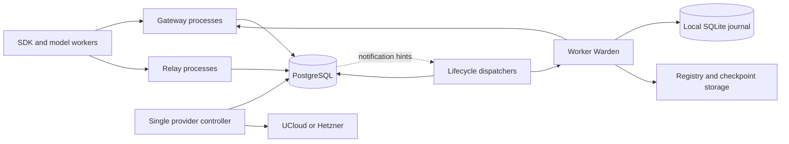

# Shared control plane and overload handling

Status: production routing and relay authority use PostgreSQL as of 25 September
2026. The [implemented placement architecture](placement-authority.md) describes
the canonical repository, durable lifecycle queue, worker capacity fences and
cutover. The design below records the rationale and broader direction; it is not
a claim that every proposed component or optimization has shipped.
See the earlier [relay qualification results](benchmarks/relay-load-2026-09-22/README.md). This follows the
[measured load investigation](benchmarks/relay-load-2026-09-21/README.md) and
[database options assessment](reviews/gateway-database-scaling-2026-09-21.md).

The relay has a selectable [PostgreSQL backend](postgres-relay.md), durable
park/wake dispatch and an idle cutover command. Routing moved as one authority;
provider journals remain separate. The earlier
[scheduling qualification slice](shared-control-qualification.md) is historical;
its separate ownership prototype was removed in favor of the existing routing
domain backed by PostgreSQL.

## Decision

Use **PostgreSQL as the shared durable authority and work queue** for the gateway,
relay and scheduler. Keep these as modules/processes in this repository; this is
not a proposal to introduce a collection of independently deployed microservices.
Use asynchronous database/network I/O and allow several gateway and relay
processes to share the authority. Replace fleet-wide placement locks with short
transactions affecting one sandbox and the relevant nodes.

Do **not** add Redis initially. PostgreSQL can hold both an operation's state and
its pending work atomically. A second durable queue would introduce another
delivery and recovery boundary without solving an observed requirement. In-memory
caches and best-effort notifications can accelerate reads; neither owns state.

Keep **SQLite on workers for local ownership and recovery**, behind the existing
registry/lifecycle interface. It is not a replica of the central database and does
not answer fleet scheduling queries. Immutable image/checkpoint bytes remain in
the existing registry/object storage, outside both databases.

This is an architectural choice for shared concurrency and recoverable scheduling,
not a claim that PostgreSQL alone achieves subsecond restores. Qualify a narrow
vertical slice before the production migration. If that slice cannot outperform
the simplified SQLite path under matched load, stop and revisit the choice.

## What the evidence establishes

- Current placement uses `_GATEWAY_SCHEDULING_LOCK` and a file-backed placement
  lock in `control_plane.py`. `RoutingStore` has additional Python locks and
  SQLite write transactions. Selected requests waited over six seconds for
  placement while their actual worker restore took about 0.6 seconds.
- A 40-sample profile found the placement-lock owner entering `BEGIN IMMEDIATE`
  in 19 samples and committing in five. This demonstrates contention in this
  path; it does not measure SQLite's maximum transaction throughput.
- `ControlStateStore.receive_heartbeat()` loads the heartbeat collection inside
  its write transaction. `ModelRelayState` owns in-memory request queues and an
  asyncio lock around persistence, backed by one `RelaySqliteStore` writer.
  Merely changing drivers leaves those serialization points intact.
- The final candidate completed 256 agents × eight cycles without correctness,
  health or cleanup errors. Wake p95 was 3.58 seconds and usable-exec p95 4.56
  seconds. It used four workers, whereas the initial baseline used two; the
  whole improvement is not attributable to the code.
- The test deliberately waited for parking before submitting each model result.
  That extra wait had median 7.21 seconds and p95 10.36 seconds. It was outside
  the wake timer. Both park latency and response-ready races need attention.
- Worker storage, checkpoint/restore, and a CPU-heavy two-vCPU gateway remain
  independent bottlenecks. No database removes them.

Unknowns to measure in the first slice: transaction arrival rate, writer busy
time, lock-hold distributions, WAL/fsync latency, and the share of latency in
global application locks versus durable storage.

## Alternatives considered

| Choice | Strength | Why select or reject it here |
| --- | --- | --- |
| SQLite with short transactions | Small operational footprint; existing recovery code | Valid baseline and immediate optimization. Shared writers still serialize per file; multi-host gateway ownership needs a new architecture. Do not build a custom distributed database around it. |
| PostgreSQL | Atomic relational updates, row-level concurrency, durable queues and mature recovery tooling | Selected for shared authority. Adds a database service, deployment/migration work and operational responsibility. |
| Redis as the authority | Fast in-memory access, atomic commands/scripts, queue primitives | Would require redesigning relational invariants and durability/failover behavior. The usual persistence/replication configuration is not an equivalent durability contract. Not selected. |
| PostgreSQL plus Redis | Independent cache/notification scaling | No demonstrated need yet; more failure modes and operation. Reconsider only after measuring a specific cache/fanout bottleneck. |
| Embedded KV store or custom journal | Can suit a narrow local access pattern | Does not solve multi-host scheduling by itself; would replace existing transactions, indexes and recovery with new code. No demonstrated benefit. |
| Dedicated broker alongside a database | Independent queue scale and transport features | State-to-message atomicity still requires an outbox and idempotent consumers. Current traffic does not establish a need for another service. |

SQLite's single-writer constraint is documented in its
[selection guidance](https://www.sqlite.org/whentouse.html). Redis supports
durability options, but its common every-second AOF policy can lose recent writes;
stronger persistence must be evaluated separately. Redis also documents that
`WAIT` does not make replica failover strongly consistent. Those are material
differences for generations and committed model results, not a claim that Redis
cannot be used reliably. Sources: [Redis persistence](https://redis.io/docs/latest/operate/oss_and_stack/management/persistence/),
[Redis replication](https://redis.io/docs/latest/operate/oss_and_stack/management/replication/).

## Authority and deployment boundaries

| Data | Authority and access pattern |
| --- | --- |
| Sandbox generation high-water marks, owner, lifecycle intent, tombstones | PostgreSQL; exact sandbox/operation transactions |
| Node identity, boot epoch retirement, drain tokens, reservations | PostgreSQL; transactions scoped to a node or migration pair |
| Heartbeat pressure and inventory observations | Latest durable PostgreSQL observation, plus disposable process caches; observations cannot manufacture ownership |
| Relay registrations, leases, responses and delivery state | PostgreSQL; row-scoped transitions, no authoritative process-wide queue |
| Provider operation journal and image/build catalog | PostgreSQL; initially still one provider-mutating controller |
| Worker processes, devices, local manifests, accepted operation fences | Worker SQLite; usable without gateway/database connectivity |
| Checkpoint/image payloads | Existing durable registry/object storage; database stores verified references |
| Telemetry | Existing telemetry pipeline; not a synchronous admission dependency |
| Live HTTP sockets and exec streams | Process-local and ephemeral; reconnect/replay where supported, never pretend a persisted row preserves a lost socket |

Move shared `routes.sqlite`, `control-state.sqlite`, `model-relay.sqlite3`,
`autoscaler-state.sqlite`, `images.sqlite` and authoritative registry ownership
metadata into PostgreSQL in stages. Keep disposable usage/metrics data out of the
critical transaction. Preserve registry GC roots and dependency references during
the move; an access counter is not evidence that an image/checkpoint is unowned.

Worker SQLite remains because it already supplies atomic local recovery without
a network service. Removing it would require either a different local journal,
a PostgreSQL server per worker, or a weaker offline recovery contract. None helps
the measured shared-gateway contention. Reevaluate it if its own commit or query
profile justifies a change; do not duplicate the entire central schema locally.

## Shared data model

Use typed columns for predicates, constraints, versions and small mutable state.
Keep large specifications, manifests and relay bodies in separate records; a
lease renewal must not rewrite a model response or sandbox specification.
Every key is scoped by `deployment_id`. Credentials are not notification payloads.

| Relation | Main key / purpose |
| --- | --- |
| `sandbox_identities` | Sandbox ID; monotonic generation high-water mark, retained after deletion |
| `sandbox_instances` | Sandbox ID + generation; spec reference, exact owner/boot epoch, observed state, desired state, owner version, lifecycle sequence, delete intent |
| `sandbox_specs`, `snapshot_references` | Immutable specs and verified manifests/dependencies; reference lifetime extends through uncertain operations |
| `nodes`, `retired_node_epochs` | Provider instance identity, accepted boot epoch, drain and loss proof; unique identity bindings |
| `node_observations`, `node_inventory` | Versioned pressure summary and per-incarnation observed inventory; complete-snapshot marker only after all chunks are accepted |
| `node_reservations` | Exact disk ownership and temporary startup/restore reservations, tied to operation and boot epoch |
| `operations` | Stable operation ID, expected incarnation/owner/version, kind, status, deadline, claim token, next attempt, outcome |
| `program_requests` | Request identity, model-wait/response-ready/delivery state and incarnation binding |
| `relay_registrations`, `relay_requests`, `relay_bodies` | Registration incarnation, idempotency identity, lease token/expiry, response hash, immutable body bytes and delivery acknowledgment |
| `migrations`, `provider_operations`, `drain_intents` | Existing explicit recovery protocols, not inferred from queue age |
| `image_builds`, `image_catalog`, `prepared_capacity` | Existing build identities, digests and capacity demand |

Constraints include unique request idempotency keys within a registration,
one active migration per incarnation, one current instance per sandbox ID,
unique operation identity, and nonnegative resource reservations. Every retry
checks the full identity and payload hash; a reused ID with a different payload
is a conflict. Generation allocation and instance intent commit atomically.

Initial relay body storage is a separate PostgreSQL `bytea` relation, preserving
the current 32-MiB API bounds without adding another storage dependency. Measure
WAL/retention impact with the real response-size distribution. If large bodies
dominate, an object-storage variant must upload immutable bytes before committing
their reference and garbage-collect orphan uploads with a grace period. Do not
put that upload protocol into the first slice without evidence.

Indexes cover due nonterminal operations by node/next-attempt/age, live instances
by owner, pending relay work by registration, expiry scans, and active migrations.
Use bounded retention for terminal history; never age out generation high-water
marks or unresolved ownership simply to reduce table size. Monitor autovacuum,
dead tuples, index growth and WAL volume on frequently updated queue tables.

Maintain small per-node accounting totals alongside the reservation ledger in
the same transaction. Admission reads those totals and the latest pressure
summary, not every sandbox on the node. Inventory reconciliation validates the
ledger using boot/activity revisions; it cannot overwrite newer reservations
with an older sampled aggregate. Full inventory scans remain recovery/audit
work. A mismatch quarantines the affected accounting view for reconciliation,
without deleting ownership or stopping the node.

## Transactions, locking and dispatch

Expose domain operations such as `accept_model_result`, `reserve_local_wake`,
`complete_lifecycle`, `record_inventory` and `claim_due_operations`. Do not port
whole-fleet `load/modify/save` methods into a generic database adapter.

Start with `READ COMMITTED` plus explicit row locks and conditional updates.
All conflicting capacity mutations lock the same node row; all incarnation
mutations lock the same sandbox identity/instance rows. A transaction needing
several nodes acquires them in sorted ID order, followed by sorted sandbox keys,
registration/request rows, and operation rows. Paths needing only a subset must
never acquire an earlier lock class afterward. A queue claim commits before
entering a placement transaction; it must not hold an operation lock while
acquiring node locks. Retry deadlocks/serialization failures within a deadline.

Result acceptance only creates wake intent; it does not reserve physical
resources. Lock the sandbox incarnation and request, without locking its node.
Actual dispatch reservation later locks node then sandbox and revalidates the
owner. This avoids serializing every model response on a host's node row. Do not
first lock a relay request and then reach backward for its sandbox or node.
Precompute body hashes and deserialize inputs before taking these locks.

Local wake reservation, schematically:

1. Read the likely owner without a lock; this is only a routing hint.
2. Begin a short transaction. Lock that node and the sandbox identity/instance.
3. Revalidate generation, owner version, boot epoch, capabilities, drain/delete
   state and observation freshness. If the owner changed, restart with its node.
4. If already running, return that fact. If the same wake is pending, attach to
   its operation. Otherwise reserve temporary restore resources, set the desired
   state and create one durable operation. Retain any physical disk ownership.
5. Commit, then immediately try dispatching through the normal claim path.
   A background dispatcher also finds this row if the process dies.
6. Perform the worker RPC with no database connection or transaction held.
7. In another short transaction, apply the exact operation's acknowledgment and
   newer activity proof; release only reservations proven completed/rejected.

This is not a distributed transaction with the worker. Delivery is at least
once; stable operation IDs and worker journals make effects idempotent. A claim
expiry means another dispatcher can retry the **same operation**, not that a
sandbox can be moved, its capacity reused, or its node stopped.

Dispatchers claim small due batches with `FOR UPDATE SKIP LOCKED`, commit a
claim token/expiry, and do external work afterward. Completion is conditional
on that token; late RPC evidence is reconciled against the current operation.
`SKIP LOCKED` is for work claiming, not for deciding that a locked sandbox is
absent or a node has spare capacity. PostgreSQL documents this queue use and
its inconsistent-view limitation in [SELECT](https://www.postgresql.org/docs/current/sql-select.html).

Notifications carry keys only and are hints. Dispatch immediately after commit
and issue a best-effort wake hint separately, so notification failure cannot
abort the authoritative commit. Listeners rescan on reconnect and periodically
scan due work; adaptive short polling while busy avoids a fixed one-second
dispatch floor. No HTTP long-poll holds a database connection. PostgreSQL
[NOTIFY](https://www.postgresql.org/docs/current/sql-notify.html) has transaction
and queue semantics that must not be mistaken for durable delivery.

## Relay result and park/wake protocol

Today `_worker_completion_response()` waits for `_notify_result()`. A committed
model result can therefore produce a 503 because its sandbox has not woken.
The new design separates durable result acceptance from execution readiness.

1. Model request acceptance persists the request before acknowledging it. The
   managed sandbox's model-wait intent is idempotent and generation-bound.
2. A result transaction checks the registration and inference lease, stores the
   response once, marks the request ready, and creates/updates the sandbox's wake
   operation in the **same PostgreSQL database transaction**. Model retry cannot
   enqueue duplicate inference or allocate another sandbox generation.
3. The gateway/dispatcher attempts wake immediately. Lack of local capacity
   leaves durable queued work with a reason and next eligibility condition.
4. Successful restore records node/activity/transport epochs. Delivery follows
   the existing reconnect protocol; a pre-park transport cannot consume a
   post-restore response under the wrong epoch.
5. Response retention covers the delivery protocol and authenticated replay.
   A timeout or dispatcher crash does not discard the sampled response.

Park and wake cannot rely on a per-process asyncio lock once there are multiple
relays. Introduce a monotonic **lifecycle sequence within the sandbox generation**
and persist the highest accepted sequence at the worker. A delayed park command
cannot park an incarnation after a newer wake command. This is a versioned worker
capability, not a change that can safely be enabled against old workers.

Before dispatch, skip a queued park if a result is already ready. If parking is
already executing, serialize locally and either prove cancellation safe or finish
it and wake; do not interrupt filesystem/device transitions arbitrarily. The
desired-state record coalesces obsolete queued work, but never erases evidence of
an in-flight side effect. Admission considers all outstanding model calls and
active execs, not just the most recent response for a sandbox.

Compatibility rollout: initially the existing completion endpoint still waits
for the shared operation up to its current deadline, while server-side recovery
continues independently of the caller. Add an explicit opt-in/versioned mode that
acknowledges durable acceptance with `delivery_state=queued|ready|terminal` and an
operation ID. Only that mode changes acknowledgment semantics. Upgrade/test the
SDK and Verifiers before making it their default. Do not silently reinterpret
today's `ok` response as a different completion guarantee.

The database transition itself can preserve public APIs. Lifecycle sequencing
requires worker/backend rollout; asynchronous acknowledgment requires an SDK
change. Existing attached exec streams retain their documented limitations;
durable managed-process identity does not make every old exec session resumable.

## Overload is queued demand, with physical safety limits

Accepted operations live in durable queues, rather than one waiting thread/RPC
per sandbox. Identical wakes coalesce per incarnation. A request waiting on
capacity does not repeatedly upload data, recreate admission state or restart
model inference. Return queue reason, age and operation identity in status.

Use per-node work classes: interactive wake/exec, cold create/import, then
publication/compaction. Give background work a progress share and age requests
to prevent starvation. Use tenant/run fairness within a class where the API has
that identity; preserve oldest-ready age across transient retries. `SKIP LOCKED`
alone is not a fairness policy.

Disk ownership is exact and additive. CPU/memory limits remain per-sandbox caps,
not permanent additive reservations for every parked sandbox. Estimate temporary
restore memory/I/O demand from checkpoint working-set measurements, with a
conservative fallback when unknown. Pending/in-flight reservations cover the gap
before actual usage appears in observations. Retire them only when exact worker
proof establishes completion or rejection; do not subtract both measured usage
and the same completed reservation indefinitely.

The worker remains the final physical admission authority. Adapt startup/restore
concurrency per node from measured completion throughput, queue delay, available
memory, CPU saturation, I/O latency and PSI. Start with the current qualified
setting; raise a small amount only while queued work exists and throughput
improves, and back off when stalls or tails worsen. Require multiple measurement
windows and cooldowns to avoid oscillation. Memory/device/disk safety ceilings
remain. A local deferral updates the shared operation and waits for capacity
progress; it is not a terminal client-facing "memory pressure" failure.

Cancellation of a waiting HTTP request does not cancel durable accepted work.
Explicit operation cancellation is another fenced intent. Keep finite submission
quotas for retained bytes and work per tenant/deployment, not a magic maximum of
256 or 512 sandboxes. When that durable backlog is full or a deadline cannot be
honored, reject **before acceptance** with a stable overload reason and retry
guidance. For accepted work, deadline expiry reports its known/uncertain outcome;
it must not claim an in-flight side effect was undone. Unlimited queueing cannot
make an overloaded machine meet a latency target.

Cache-preserving local wake wins when its predicted completion is sooner than
migration. Migrate only a portable, verified park with enough destination
capacity and the existing source-fencing protocol. Consolidate during spare I/O
capacity with hysteresis; never create a migration storm to chase short-lived
pressure. Publication/compaction remains below interactive restoration and must
stop wasting work on superseded lifecycle versions, without starving durable
publication indefinitely. These worker/storage changes are separate from SQL.

## Failure behavior

The [distributed state protocol](distributed-state-protocol.md) remains the
baseline. A multi-host controller protocol must be added explicitly; PostgreSQL
connectivity alone does not extend the current POSIX-lock contract.

| Failure | Required result |
| --- | --- |
| Gateway/relay exits after commit, before dispatch | Another dispatcher finds the durable operation; original result/request is replayable |
| Worker completed, acknowledgment lost | Retry/query the same operation and incarnation; no second reservation or placement |
| Dispatcher claim expires during RPC | Another dispatcher may retry; worker operation/sequence fences reject stale effects |
| Database unavailable | No new ownership mutations acknowledged; running work continues locally, accepted local transitions recover from worker journal; gateway resumes reconciliation later |
| Heartbeat late or missing | Mark observation stale and stop assigning new work; do not infer node death, delete ownership or authorize provider termination |
| Worker genuinely lost | Apply existing validated loss proof and portable-snapshot classification; database choice does not recover unpublished local state |
| Duplicate/out-of-order heartbeat | Enforce node identity, retired boot epochs and activity revisions; older observations cannot undo synchronous acknowledgments |
| Relay notification lost | Periodic/reconnect scan finds durable work; notifications are not authority |
| Old primary/gateway reconnects | Database failover must fence the old primary; worker generation/owner/lifecycle fences still apply |
| Backup restored to an older point | Freeze mutations and reconcile identities/high-water marks against workers and operation evidence; never resume with potentially reused generations |

Keep one provider-mutating autoscaler in the first release. Move its journal to
PostgreSQL, but retain exclusive execution and provider operation labels. A future
multi-host leader needs provider fencing/reconciliation: losing a DB advisory
lock cannot cancel an already-issued VM stop. Planned shutdown still requires
matching drain token, fresh complete empty inventory, no reservations and no
newer activity. Failed observation and elapsed time alone are not authorization.

## Deployment and operational cost

Place PostgreSQL on reliable durable storage, separate from registry/checkpoint
I/O and outside the autoscaled worker pool. Prefer an existing managed service
with verified private connectivity, latency, backup and failover behavior. If
self-hosting, use a primary and synchronous standby on different hosts with
documented fenced promotion; do not invent an HA controller as part of this work.
A single primary is adequate for the prototype but is not an HA claim.

Use durable local WAL commits and, for the production HA contract, synchronous
replication to the required standby before acknowledging critical writes. Do not
silently downgrade to asynchronous replication on standby failure. This trades
write availability/latency for preserving acknowledged ownership through a
qualified single-host failure. PostgreSQL replication does not remove the need
for old-primary fencing or backups. See [standby and replication behavior](https://www.postgresql.org/docs/current/warm-standby.html).

A provisional benchmark starting point is a dedicated 4-vCPU/8-GiB DB host with
low-latency SSD and a comparable standby; this is a test configuration, not a
capacity guarantee or procurement recommendation. Size retained response bodies
and WAL from measured byte rates and retention. Keep DB connections pooled per
process, with short acquisition deadlines and an overall connection budget.
Pool size bounds database work, not accepted sandbox count. Hold no connection
while waiting for model inference, a worker RPC or an HTTP long-poll.

Use primary reads for ownership and admission decisions. Disposable route caches
carry generation and owner versions; workers still validate them, and stale-owner
responses trigger authoritative refresh. Read replicas may serve reporting but
must not make capacity or generation decisions from lagged state. Listener
processes may retain a dedicated notification connection, outside request pools.

Run multiple API/relay processes only after removing authoritative in-memory
queues and global placement locks. Keep Python: asynchronous I/O helps waiting,
and separate processes can use more cores. Profile CPU decoding/serialization
before selecting a different language. Avoid adding DB work to health/liveness
handlers; readiness should expose dependency failures separately.

Use the existing relay's aiohttp stack for the target asynchronous gateway
handlers as well, with an async PostgreSQL driver and pool. Refactoring today's
synchronous gateway handlers is part of the work, not an automatic benefit of
installing PostgreSQL. During transition, isolate remaining blocking handlers in
a bounded executor; the wake/result path must not wait behind them. Keep SDK
HTTP routes and identity/error contracts stable through that refactor.

Require automated backups/WAL retention, a restore drill, schema migration
ownership, least-privilege service roles, private authenticated connections,
and alerts for disk/WAL growth, replication lag, long transactions, pool wait,
queue age and stuck operations. These are real costs of the database choice.

## Latency and capacity qualification

Primary product metric: model response ready outside the relay to the sandbox's
next successful tool operation, including result upload, admission, any remaining
park, restoration and delivery. Also report commit acknowledgment and worker-only
restore separately. Preserve the forced-park stress mode, but add a natural mode
that submits results immediately when ready. No hidden wait before the timer.

Target p95 below one second at 256 and 512 agents for a declared healthy,
same-node, cache-warm workload and measured arrival rate. Report all outcomes and
separate cold creates, cross-node imports, node loss and database outage; those
need correctness/recovery targets rather than a fictional universal one-second
promise. Include delayed parks and pressure-deferred wakes in the healthy-load
measurement, not as exclusions. Define and publish the qualified image, memory,
dirty bytes, model delay, response sizes, hardware and worker placement.

For initial diagnosis, budget roughly 100 ms for response commit/admission,
100 ms for dispatch/coordination, 600 ms for restore, and 200 ms for delivery/tool
readiness. These are design allocations, not measured guarantees or a claim
that component p95s add to end-to-end p95. If restore itself exceeds the budget,
the database project cannot satisfy the target.

With one response per agent every 12.5 seconds, 512 agents offer about 41 wakes/s
before accounting for their other work. Test that steady rate, faster rates, and
a synchronized 512-response burst separately. A burst's lower bound depends on
measured aggregate restore throughput; sandbox count alone does not define load.

Qualification must include:

- Fixed fleet/placement and matched candidate coverage; repeated SQLite and
  PostgreSQL trials with identical durability, cache state and workload.
- Separate app-lock wait, pool wait, row-lock wait, transaction body, commit,
  dispatch queue, restore queue, restore and delivery distributions; correlated
  end-to-end traces. Record p50/p95/p99/max, errors, throughput and host CPU/I/O.
- 64/256/512 agents, natural and forced-park modes, real body-size distribution,
  write-heavy checkpoints, a hot-node skew, and a burst exceeding steady capacity.
- Two gateway and two relay processes concurrently; kill/restart each between
  intent, dispatch, side effect, acknowledgment and delivery. Duplicate/reorder
  messages and expire claims/leases. Verify one model result, no stale parks,
  no double resource reservation and no generation reuse.
- Database restart and qualified standby failover, lost notifications, stale
  inventory, node reboot/loss, deletion during wake, and migration recovery.
- Enough repeated cycles to detect backlog drift, memory growth, WAL growth and
  starvation; a short smoke test or one eight-cycle run is not a soak test.

Accept the slice only with zero invariant violations, bounded backlog at the
declared sustainable rate, materially smaller coordination tails than the
matched baseline, and demonstrated recovery. Do not claim 512 capacity until the
512 test passes. Full rollout additionally requires the product latency target
or an explicit report of the measured remaining worker bottleneck.

## Implementation sequence and migration

1. **Instrument and specify.** Add timing/count metrics to current domain
   transactions and the natural-mode harness. Freeze the state-transition
   contract in backend-independent tests. Preserve the current SQLite path as
   the comparison, not as a permanent lowest-common-denominator abstraction.
2. **Build one PostgreSQL vertical slice.** Implement typed schema/migrations,
   exact local-wake reservation, operation claiming/completion, and result-plus-
   wake atomic commit. Test real concurrent database connections and crash
   windows. Use async queries rather than synchronous calls on the event loop.
   Run the matched reproduction before porting unrelated stores.
3. **Finish shared authority.** Port heartbeats/inventory, registration/lease/
   delivery, generations/delete, migrations, images/builds and provider journal.
   Replace relay global state with row-scoped transitions and local waiter maps.
   Remove placement file locks only after the transaction contract qualifies.
   Add lifecycle sequence capability and qualify mixed-version fail-closed behavior.
4. **Rehearse an idle cutover.** Take consistent backups, pause *all* old writers
   (gateway, relay, autoscaler, heartbeat ingestion, pruning and maintenance),
   export the related stores together, and import/validate references, counts,
   hashes, generations, pending results, operations and GC roots. Preserve exact
   IDs. If idle cutover is unavailable, design CDC separately; do not improvise
   uncoordinated dual writes. Empty sandbox routes alone do not prove relay or
   provider work is idle.
5. **Activate one authority.** Fence old writer processes/configuration, select
   PostgreSQL for the whole deployment, reconcile worker inventories and run
   canaries before opening normal admission. Keep the old stores read-only for
   investigation. Do not mix SQLite and PostgreSQL scheduling writers in a
   canary against the same deployment.
6. **Roll out execution and API improvements.** Qualify multiple API/relay
   processes, pressure-driven worker concurrency and fair queues. Introduce
   opt-in asynchronous result acknowledgment with SDK/Verifiers contract tests,
   then consider making it default. Remove transitional shared SQLite code only
   after recovery and rollback rehearsals succeed.

Before PostgreSQL accepts mutations, rollback is switching back to the frozen
SQLite authority. After it accepts writes, the old SQLite files are stale:
rollback means a compatible application against PostgreSQL, or a quiesced,
validated reverse export preserving every accepted operation and high-water mark.
Never fall back automatically to those old files after a database outage.

The first implementation deliverable is therefore the measured local-wake and
relay-result slice, not a wholesale ORM conversion. It establishes whether the
selected architecture buys sufficient concurrency without compromising recovery.

## Code boundaries for implementation

| Current module | Change |
| --- | --- |
| `routing.py` | Replace broad mutable snapshots with the domain transaction API; retain immutable value types and identity validation |
| `control_plane.py` | Remove fleet placement locks after database qualification; await shared operations without keeping worker threads or transactions occupied |
| `control_state.py` | Upsert one validated node observation and changed inventory rows; stop decoding the fleet inside heartbeat writes |
| `model_relay.py` | Replace the authoritative in-memory queue/lock with database transitions; retain local socket waiters and transport handling |
| `cli.py` | Wire database pools and dispatcher lifecycle; keep HTTP/network work asynchronous |
| `program_scheduler.py`, `resource_admission.py` | Keep scheduling policy as testable functions over bounded candidate views, separate from atomic reservations |
| `autoscaler_state.py` | Preserve provider operation journal semantics while changing persistence; do not silently broaden controller leadership |
| `direct_registry.py`, `direct_service.py`, `node_runtime.py` | Keep local durability; add versioned lifecycle ordering and qualify adaptive worker admission separately |

Operational choices still requiring environment validation are the available
PostgreSQL hosting service, its actual failover/RPO contract, network latency and
storage performance. They determine deployment details, not whether Redis should
own sandbox state. No purchase, provisioning or migration is implied by this RFC.
