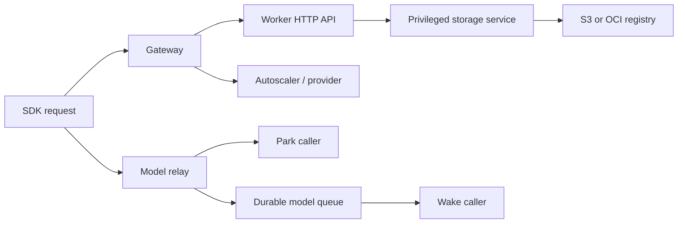

# Performance telemetry

The platform emits distributed traces and metrics over OTLP/HTTP. SQLite is
still used for controller facts that affect scheduling and for the lightweight
operator dashboard, but it is no longer a trace store. A trace backend such as
Grafana Tempo owns sampled spans; a metrics backend such as Prometheus, Mimir,
or VictoriaMetrics owns time series.

## Configuration

Telemetry is one exact block in deployment schema 5:

```json
{
  "telemetry": {
    "endpoint": "http://10.42.0.2:4318",
    "trace_sample_ratio": 0.1,
    "export_interval_ms": 5000,
    "export_timeout_ms": 3000,
    "max_queue_size": 4096,
    "max_export_batch_size": 512
  }
}
```

`endpoint` is an HTTP(S) origin, not an OTLP signal path. The processes append
`/v1/traces` and `/v1/metrics`. An empty endpoint disables telemetry and keeps
HTTP request handling on a single boolean branch. On Hetzner, use the gateway's
stable private address, listen only on the private network, and permit port
4318 only inside the deployment network. Workers receive the same settings in
their VM-init contract.

The recommended backend layout is:

- an OpenTelemetry Collector or Grafana Alloy receiver on the gateway;
- Tempo with its native S3 backend for trace blocks;
- Prometheus-compatible storage for metrics;
- Grafana for trace search, service graphs, and metrics-to-trace navigation.

Tempo should access Object Storage through its S3 client. Do not mount the
bucket as a filesystem. Telemetry retention is independent of sandbox snapshot
retention and should use a separate bucket or at least separate credentials and
prefix authority.

The Hetzner installer cuts trace blocks every five minutes, completes them
within ten minutes, and flushes on graceful shutdown. This bounds the period
for which an acknowledged trace exists only in Tempo's volume-backed WAL while
avoiding a new object per request.

Install or converge the bounded gateway stack with the same credential file
used by the snapshot store:

```bash
sudo scripts/install_hetzner_otlp_stack.sh \
  --private-bind-ip 10.42.0.2 \
  --s3-endpoint https://hel1.your-objectstorage.com \
  --s3-bucket sandboxes \
  --s3-region hel1 \
  --s3-prefix production/telemetry/tempo \
  --credentials-env-file /etc/ucloud-sandboxes/snapshot-store.env \
  --data-root /mnt/ucloud-registry/telemetry
```

The data root holds Tempo's crash-recovery WAL and VictoriaMetrics' bounded
14-day database. It must be a persistent local filesystem or attached Volume;
trace blocks themselves are written through Tempo's native S3 client.

### UCloud gateway stack

UCloud does not provide the Hetzner deployment's S3-compatible object-storage
path. For a small deployment, the gateway can instead run Collector, Tempo,
VictoriaMetrics, and Grafana together on its local ext4 filesystem:

```bash
sudo scripts/install_ucloud_observability_stack.sh \
  --private-bind-ip 10.40.0.2
```

The installer caps and lowers the CPU priority of all four containers. OTLP is
bound only to the gateway's private IPv4 address. Grafana and both backend
query APIs bind to loopback; reach Grafana with an SSH tunnel to local port
3000. Tempo keeps 72 hours of traces, VictoriaMetrics keeps 14 days of metrics,
and the metrics store leaves at least 20 GB of local disk free. Do not put its
data root on `/work` or another shared UCloud mount: request-path telemetry I/O
must not contend with sandbox images and snapshots.

This is a practical single-node diagnostic setup, not an HA telemetry service.
Gateway loss also loses the retained telemetry. If production volume or the
gateway lifecycle outgrows those constraints, move the stores to external
durable services while retaining the same private Collector endpoint.

For agent-led diagnosis, install `ucloud_observability_report.py` beside the
installer and retrieve one bounded, secret-free JSON snapshot directly from the
gateway:

```bash
ssh ucloud@ssh.cloud.sdu.dk -p GATEWAY_PORT \
  sudo ucloud-observability-report \
    --window 30m --rate-window 5m --trace-limit 5
```

The report includes service and backend health, gateway memory/disk/load,
telemetry container resource use, operation counts/errors/rates, p50/p95/p99
latency by service and operation, slow trace summaries, and the longest spans
from selected traces. Error traces are selected before merely slow traces so a
small trace limit still captures failures. Thread CPU/wall ratios help distinguish likely CPU work
from I/O or queue waits. Agents should use this report as their first diagnostic
surface; Grafana is a complementary human exploration UI.

The report exposes both recent rate-based quantiles and cumulative quantiles
since each reporting process started. The cumulative view is important for
low-frequency operations such as park, wake, image build, and VM bootstrap:
Prometheus cannot calculate a rate for an event already present in a time
series' first sample.

Worker heartbeat `actual_usage` also exposes snapshot publication saturation as
`storage_publication_active`, `storage_publication_waiting`, and
`storage_publication_limit`. It also exports cumulative publication count,
compaction count, uploaded bytes, total/max queue wait, and total/max duration.
These are separate from the storage daemon's
general operation semaphore, so an agent can distinguish a Registry/S3 upload
queue from local mount, release, or device pressure. Publication saturation is
diagnostic only: another VM cannot make an existing local checkpoint portable,
so it is excluded from autoscaling's actionable storage-pressure signal.

From a source checkout, the wrapper resolves the live SSH port through the
active UCloud project and returns the same report in one command:

```bash
scripts/read_ucloud_observability.sh GATEWAY_JOB_ID \
  --window 30m --rate-window 5m --trace-limit 5
```

## What one trace contains

W3C `traceparent` and `tracestate` propagate across every synchronous boundary:



The storage Unix-socket protocol is schema 4 and carries trace context as an
explicit field. Relay requests persist their original trace headers with the
durable queue item, so worker delivery and a later wake can be correlated even
after the caller connection is parked or recreated. Image-build and snapshot
publication threads capture context before leaving the request thread.

Important span groups include:

- `gateway.sandbox_create` and its image resolution, placement, pull, and node
  proxy phases;
- `gateway.node_response_headers`, `gateway.node_response_body`, and
  `node.sandbox_exec_start`, separating gateway fanout, response transfer, and
  worker process startup without recording command content;
- `sandbox.park`, checkpoint, artifact commit, runtime stop, storage release,
  and background publication;
- `sandbox.wake`, network setup, storage mount, runsc restore, readiness, and
  journal commit timings;
- `storage.client.*` and `storage.server.*`, including semaphore queue wait;
- `snapshot.export_and_upload`, `snapshot.compact_and_upload`, metadata commit,
  and verification;
- `image.build.worker` plus Docker build/push timings;
- `sandbox.exec.session`, covering the complete asynchronous process lifetime
  and exit status without recording commands, arguments, environment, or output;
- `relay.park_caller`, worker wait, and `relay.wake_caller`;
- `autoscaler.reconcile`, provider list/create/terminate, and `vm.bootstrap`.

Every sampled HTTP response includes `X-Trace-Id`; standard trace propagation
headers are also returned. IDs, lifecycle generations, byte counts, outcomes,
bounded phase timings, sampled thread CPU duration, and the corresponding
CPU/wall ratio are attributes or events. Credentials, request bodies, model
prompts, file contents, and S3 keys are not recorded.

Sampled spans lasting at least one millisecond carry
`ucloud.span.thread_cpu.duration` in seconds. Divide it by the span's standard
wall duration in the trace backend to obtain the CPU/wall ratio without
recording a redundant attribute. Shorter spans still pay the two clock reads,
but skip attribute storage because their individual CPU split is not useful.
This is a cheap screening signal: a long span with little thread CPU is waiting,
while a long span with a ratio near one is a candidate for code-level
optimization. Parent spans include CPU consumed by nested child work on the
same thread. For asyncio services, unrelated coroutines may also execute on
that event-loop thread while a span is suspended, so treat the ratio as
directional under high concurrency rather than as exact per-request accounting.

AgentEnv's ublk daemon exposes its own low-cardinality Prometheus metrics on
`127.0.0.1:9103`. A node-local collector can scrape that endpoint without
opening it to the deployment network. These native metrics cover the remote
block cache and ZFile behavior that application spans cannot explain.

## Performance invariants

Telemetry must lose data before it slows product work:

- span export uses one bounded in-memory queue and a daemon exporter thread;
- request threads only perform a non-blocking queue append;
- a full queue drops spans and increments `dropped_spans`;
- OTLP serialization, DNS, retries, and network I/O never run on request
  threads;
- trace sampling is parent-based and defaults to 10%;
- thread CPU uses two local clock reads only for sampled spans;
- metric labels are limited to operation name and outcome;
- no per-sandbox metric series are created;
- exporter failure cannot change an API, park, wake, build, or provider result.

`GET /v1/metrics` and the operator dashboard expose exporter queue capacity,
accepted/exported/dropped span counts, failed exports, and the last exporter
error. This health data is operational state, not a duplicate trace store.

The test suite freezes the exporter, saturates its queue, and verifies that a
burst of request-thread spans completes without waiting for the exporter.
The initial 100,000-operation microbenchmark is recorded in
[`benchmarks/telemetry-overhead-2026-08-13.json`](benchmarks/telemetry-overhead-2026-08-13.json);
at 10% sampling it measured 9.821 microseconds of instrumentation per synthetic
operation with no drops. A seven-run paired follow-up measured the sampled
thread-clock addition at 1.136 microseconds per operation at that 10% sampling
rate. This is an overhead guardrail, not a substitute for live park/wake
latency comparisons.

## First performance views

Start with distributions rather than averages:

- p50/p95/p99 `sandbox.park` and `sandbox.wake` by service version;
- park time split between runsc checkpoint, local sealing, publication queue,
  export/compaction, upload, and metadata commit;
- wake time split between remote verification/mount, runsc restore, and
  readiness;
- snapshot upload throughput as uploaded bytes divided by publication time;
- storage semaphore queue wait and concurrent publication queue wait;
- image build queue, Docker build, push, and context cleanup;
- provider create, VM bootstrap staging, and remote init separately;
- relay model wait versus response-to-wake latency.

Compare versions using `service.version` and deployments using
`deployment.id`. Resource attributes `cloud.provider` and `cloud.machine.type`
make Hetzner/UCloud and node-profile comparisons explicit. Alert on exporter
drops as well as platform latency: a fast graph with a saturated telemetry
queue is not trustworthy.
